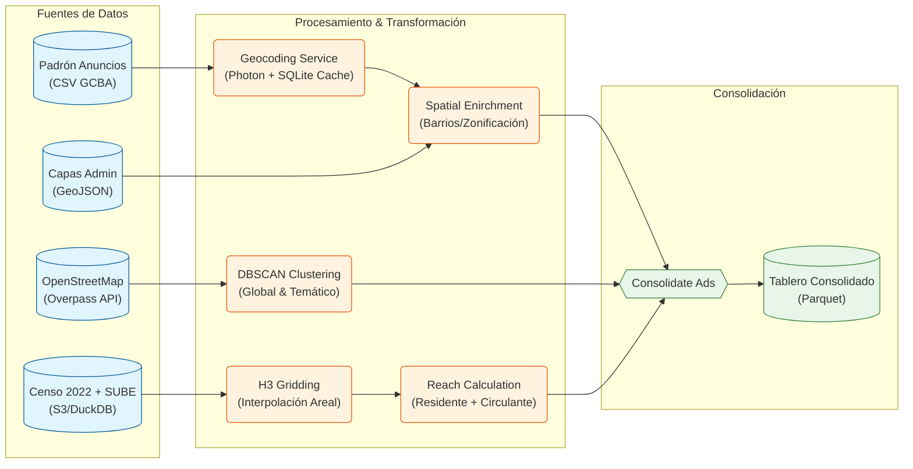

# BA OOH Ads: Análisis de Publicidad Exterior

Proyecto de Data Engineering y Análisis Espacial que implementa un pipeline ETL moderno para extraer, procesar y visualizar el impacto de la publicidad en vía pública en la Ciudad de Buenos Aires.

## 🎯 Propósito del Pipeline

El objetivo principal de este proyecto es migrar un análisis legacy a una arquitectura escalable en Python, capaz de ingerir datos de padrones publicitarios, geolocalizarlos con precisión y enriquecerlos con contexto urbano (puntos de interés comercial y alcance poblacional). El sistema final alimenta un dashboard interactivo para la toma de decisiones basada en datos espaciales.

Los componentes principales del pipeline son:

* **Extracción (E):** Consume datos heterogéneos de múltiples fuentes:
1. **Padrón de Anuncios:** Datos administrativos del GCBA (CSV).
2. **Entorno Comercial (POIs):** Extracción de OpenStreetMap via Overpass API (OSMnx).
3. **Demografía y Movilidad:** Datos del Censo 2022 (INDEC) y viajes en transporte público (SUBE) procesados con DuckDB.
4. **Capas Administrativas:** GeoJSONs oficiales de Barrios, Comunas y Zonificación.


* **Transformación (T):**
* **Geocodificación:** Normalización de direcciones y geocoding contra APIs (Photon) con una capa de caché persistente en SQLite.
* **Modelado Espacial:** Generación de grillas hexagonales **H3** (Uber) para unificar geometrías dispares.
* **Machine Learning:** Detección de centralidades comerciales mediante algoritmos de clustering (**DBSCAN**).

* **Consolidación:** Integra todas las dimensiones en una estructura columnar optimizada (`.parquet`) lista para ser explotada por el motor de visualización.

## 📁 Estructura del Repositorio

```text
ba_ooh_ads/
├── app/                  # Aplicación Web (Shiny for Python)
│   ├── app.py            # Lógica del servidor y UI
│   └── components/       # Componentes de UI reutilizables
├── data/                 # Volúmenes de datos (gestionados por Docker)
│   ├── raw/              # Datos crudos (CSV, YAML)
│   ├── processed/        # Datos transformados (Parquet)
│   ├── external/         # Capas geográficas (Barrios, Censo)
│   └── cache/            # Bases de datos SQLite (Geocoding, OSM)
├── src/                  # Código fuente del ETL
│   ├── config.py         # Configuración centralizada (Pydantic)
│   ├── etl/              # Pipelines de Datos
│   │   ├── ads/          # Pipeline de Anuncios (Extract, Geocode, Transform)
│   │   ├── pois/         # Pipeline de POIs (Clustering DBSCAN)
│   │   └── population/   # Pipeline de Población (Censo + H3 Reach)
│   └── utils/            # Utilidades espaciales y de logging
├── tests/                # Tests unitarios e integración
├── Dockerfile            # Imagen base (Python 3.11 + uv)
├── docker-compose.yml    # Orquestación de servicios
└── Makefile              # Entrypoints para comandos comunes

```

## 🛠 Tech Stack

* **Lenguaje:** Python 3.11
* **Gestión de Paquetes:** `uv` (Astral)
* **Contenerización:** Docker & Docker Compose
* **Procesamiento:** Pandas, Geopandas, DuckDB (OLAP local), Shapely
* **Espacial:** H3 (Uber), OSMnx, Scikit-learn (DBSCAN)
* **Dashboard:** Shiny for Python, Ipyleaflet
* **Testing:** Pytest, Pytest-mock

## 🚀 Instalación y Despliegue con Docker

El proyecto está totalmente contenedorizado. Se utiliza `uv` para una gestión de dependencias rápida dentro de la imagen.

1. **Clonar el Repositorio:**
```bash
git clone "https://github.com/tu_usuario/ba_ooh_ads.git"
cd ba_ooh_ads

```

2. **Configurar Variables de Entorno (Opcional):**
El proyecto utiliza `pydantic-settings` en `src/config.py`. Por defecto, los paths son relativos a la raíz del proyecto. Si necesitas cambiar directorios o configurar credenciales futuras, crea un archivo `.env` en la raíz.
3. **Construir y Ejecutar el Pipeline ETL:**
Utilizamos un `Makefile` para simplificar la orquestación.
* **Construir la imagen:**
```bash
make build

```

* **Ejecutar el Pipeline Completo:**
Este comando descarga capas administrativas, procesa anuncios (incluyendo geocoding), extrae POIs, calcula clusters y cruza datos censales.
```bash
make etl-full

```

> **Nota:** La primera ejecución puede demorar debido a la descarga de datos censales y el proceso de geocodificación. Las ejecuciones subsiguientes son rápidas gracias al caché en SQLite.


* **Ejecutar pasos individuales (Ejemplos):**
```bash
make layers       # Solo capas administrativas
make ads          # Solo padrón de anuncios
make osm_pois     # Solo POIs y Clustering
make popu_reach   # Solo cálculo de alcance poblacional

```


4. **Desplegar la Visualización:**
Levanta el servidor de Shiny for Python.
```bash
make up

```

Accedé al dashboard desde el navegador ingresando en: `http://localhost:8000`


## 🧬 Arquitectura y Flujo de Datos

El sistema integra flujos asincrónicos de datos espaciales que convergen en un dataset consolidado.

### Diagrama de Flujo del Pipeline ETL



### Descripción de Scripts Principales

* **`src/etl/ads/geocoding_ads.py`**: Implementa un servicio de geocodificación con "cache-aside". Antes de consultar la API externa (Photon), verifica si la dirección ya existe en una base de datos local SQLite (`geocache.db`), reduciendo drásticamente los tiempos de re-procesamiento.
* **`src/etl/pois/centrality_clustering.py`**: Aplica el algoritmo no supervisado **DBSCAN** sobre los Puntos de Interés (POIs) de OSM. Genera polígonos (Concave Hulls) que representan zonas comerciales ("clusters") globales y temáticas (ej: polos gastronómicos).
* **`src/etl/population/population_reach.py`**: Utiliza **DuckDB** para procesar grandes volúmenes de datos censales (residentes) y transaccionales de transporte (circulantes). Interpola estos datos a una grilla hexagonal **H3 (Resolución 9)** para estimar la audiencia potencial de cada ubicación.
* **`src/etl/ads/consolidate_ads.py`**: Es el paso final del ETL. Cruza los anuncios geolocalizados con los clusters comerciales y métricas de alcance poblacional (K-Ring neighbors) para generar el archivo `tablero_anuncios_consolidado.parquet`.

### Modelo de Datos Consolidado

El archivo final `.parquet` es una tabla desnormalizada ("One Big Table") optimizada para lecturas rápidas en el dashboard:

| Campo | Tipo | Descripción |
| --- | --- | --- |
| `id_anuncio` | Int | Identificador único del cartel. |
| `lat`, `long` | Float | Coordenadas geográficas. |
| `full_address` | String | Dirección normalizada. |
| `tipo`, `clase` | String | Atributos físicos del cartel (Pantalla, Frontal, etc.). |
| `barrio`, `comuna` | String | Datos administrativos (Spatial Join). |
| `cluster_global` | Int | ID del cluster comercial general al que pertenece. |
| `cluster_tematico` | Int | ID del cluster específico (ej: Gastronomía). |
| `total_reach` | Int | Estimación de personas (residentes + circulantes) en el área de influencia. |
| `h3_index` | String | Índice hexagonal H3. |

## 🗃️ Visualización con Shiny

La aplicación (`app/app.py`) consume el parquet consolidado y expone una interfaz reactiva utilizando **Shiny for Python**.

* **Frontend:** Utiliza `ipyleaflet` para renderizado de mapas de alto rendimiento, permitiendo visualizar miles de puntos y polígonos con clustering dinámico.
* **Backend:** Utiliza **DuckDB** en memoria para filtrar y agregar datos en tiempo real según las interacciones del usuario en el sidebar (filtrado por barrio, tipo de anuncio o categoría comercial).
* **Interactividad:** Al seleccionar un anuncio, un popup despliega el perfil completo del activo, incluyendo su ID y métricas de alcance.

## 🧪 Testing

El proyecto cuenta con una suite de pruebas robusta ubicada en `tests/`, ejecutada con `pytest`.

* **Unit Tests (`tests/unit/`):** Validan la lógica aislada. Ej: `test_geocoding_service.py` verifica que el sistema use la caché SQLite antes de llamar a la API; `test_spatial.py` valida las funciones de conversión H3 y joins espaciales.
* **Integration Tests (`tests/integration/`):** Validan flujos completos. Ej: `test_ads_pipeline.py` simula una ejecución end-to-end del módulo de anuncios usando datos mockeados y un sistema de archivos virtual.
* **Ejecución:**
```bash
# Ejecutar todos los tests dentro del contenedor
docker-compose run --rm app pytest

```


## 🔗 Enlaces Útiles

* **Fuentes de Datos:**
* [BA Data: Padrón de Anuncios](https://www.google.com/search?q=https://data.buenosaires.gob.ar/dataset/padron-anuncios-empadronados)
* [INDEC: Censo Nacional 2022](https://www.indec.gob.ar/indec/web/Nivel4-Tema-2-41-165)
* [Transporte: Viajes SUBE](https://data.buenosaires.gob.ar/dataset/viajes-etapas-transporte-publico)


* **Documentación Técnica:**
* [H3: Uber’s Hexagonal Hierarchical Spatial Index](https://h3geo.org/)
* [Shiny for Python](https://shiny.posit.co/py/)
* [OSMnx: Python for Street Networks](https://osmnx.readthedocs.io/)