# REPOSITORIO: ba_ooh_ads

## Archivos Raíz

# ==========================================
# FILE: Dockerfile
# ==========================================
```python
# Usamos una imagen base ligera de Python 3.11
FROM python:3.11-slim-bookworm

# 1. Instalar dependencias del sistema operativo necesarias
# (curl/git a veces son necesarios, libsqlite3 viene por defecto pero aseguramos)
RUN apt-get update && apt-get install -y --no-install-recommends \
    curl \
    ca-certificates \
    unrar-free \
    gdal-bin \
    && rm -rf /var/lib/apt/lists/*

# 2. Copiar el binario de uv desde la imagen oficial (Truco Pro)
COPY --from=ghcr.io/astral-sh/uv:latest /uv /bin/uv

# 3. Configurar entorno
WORKDIR /app
# Habilitar bytecode compilation para arranque más rápido
ENV UV_COMPILE_BYTECODE=1
# Usar el sistema de caché de uv en una ubicación controlada
ENV UV_CACHE_DIR=/opt/uv-cache/

# 4. Instalar dependencias de Python
# Copiamos solo los archivos de definición primero para aprovechar el caché de capas de Docker
COPY pyproject.toml uv.lock ./

# Instalamos las dependencias en el entorno del sistema (--system) o creando un venv.
# En Docker, usar --system suele ser más simple, pero uv recomienda sync.
# Usaremos 'uv sync' creando un venv en /app/.venv que añadiremos al PATH.
RUN uv sync --frozen --no-cache

# Agregar el entorno virtual al PATH para que 'python' sea el del venv
ENV PATH="/app/.venv/bin:$PATH"
ENV PYTHONPATH="/app/src:/app"


# 5. Copiar el código fuente
COPY src/ ./src/
COPY app/ ./app/

RUN pip install -e .
# Nota: No copiamos 'data/' aquí porque lo montaremos como volumen en docker-compose

# 6. Exponer puerto de Shiny
EXPOSE 8000

# 8. Comando por defecto: Levantar la App
CMD ["shiny", "run", "--host", "0.0.0.0", "--port", "8000", "app/app.py"]
```

# ==========================================
# FILE: docker-compose.yml
# ==========================================
```python
services:
  app:
    build: .
    container_name: ba_ooh_ads_app
    # Montamos volúmenes para:
    # 1. Desarrollo (Hot-reload del código si cambias src o app)
    # 2. Persistencia (La base de datos SQLite y los archivos descargados)
    volumes:
      - ./src:/app/src
      - ./app:/app/app
      - ./data:/app/data
      - ./tests:/app/tests
    ports:
      - "8000:8000"
    environment:
      - PYTHONPATH=/app/src:/app
      # Si usaras APIs externas con keys, irían aquí o en un .env
      # - GOOGLE_MAPS_KEY=${GOOGLE_MAPS_KEY}
    
    # Comando por defecto (Shiny). 
    # Si quieres correr el ETL, puedes sobreescribirlo con `docker-compose run ...`
    command: shiny run --host 0.0.0.0 --port 8000 app/app.py

```

# ==========================================
# FILE: Makefile
# ==========================================
```python
.PHONY: build up down shell etl clean

# Construir la imagen
build:
	docker-compose build --no-cache

# Levantar la app (Shiny) en segundo plano
up:
	docker-compose up -d

# Ver logs
logs:
	docker-compose logs -f

# Bajar todo
down:
	docker-compose down

# Entrar a la terminal del contenedor (para debuggear)
shell:
	docker-compose run --rm app /bin/bash

# Descargar capas base (Barrios, Comunas)
layers:
	docker-compose run --rm app python src/etl/population/extract_govmaps.py
	
# Ejecutar el Pipeline ETL completo dentro de Docker
ads:
	docker-compose run --rm app python src/etl/ads/extract_ads.py
	docker-compose run --rm app python src/etl/ads/transform_ads.py

# Descargar osm pois
osm_pois:
	docker-compose run --rm app python src/etl/pois/extract_osm_pois.py
	docker-compose run --rm app python src/etl/pois/pois_macro_categories.py
	docker-compose run --rm app python src/etl/pois/centrality_clustering.py

# Calcular alcance poblacional
popu_reach:
	docker-compose run --rm app python src/etl/population/population_reach.py

consolidate:
	docker-compose run --rm app python src/etl/ads/consolidate_ads.py

# Pipeline completo actualizado
etl-full: layers ads osm_pois popu_reach consolidate  

# Limpiar archivos temporales y caché de Python
clean_cache:
	find . -type d -name "__pycache__" -exec rm -rf {} +
	find . -type f -name "*.pyc" -delete

# Borrar todos los archivos en data/ (útil para reiniciar el entorno)
clean_data:
	sudo rm -rf data/*
```

# ==========================================
# FILE: pyproject.toml
# ==========================================
```python
[project]
name = "ba-ooh-ads"
version = "0.1.0"
description = "Buenos Aires Out Of Home ADS data analysis"
requires-python = ">=3.11"
dependencies = [
    "numpy",
    "pandas",
    "geopandas",
    "pyarrow",
    "scipy",
    "scikit-learn",
    "matplotlib",
    "shapely",
    "h3",
    "folium",
    "osmnx",
    "geopy",
    "rsconnect-python",
    "faicons",
    "sqlalchemy",
    "requests>=2.32.5",
    "python-dotenv",
    "ipykernel",
    "jupyterlab",
    "pip",
    "concave_hull",
    "duckdb",
    "shiny",
    "ipyleaflet",
    "ipywidgets",
    "shinywidgets",
    "plotly",
    "pydantic-settings",
]

[project.optional-dependencies]
dev = [
    "pytest",
    "pytest-cov",
    "pytest-mock",
    "black",   # Recomendado para formateo automático
    "isort",   # Recomendado para ordenar imports
    "ipykernel", # Para correr notebooks
]


[build-system]
requires = ["hatchling"]
build-backend = "hatchling.build"

[tool.hatch.build.targets.wheel]
packages = ["*"]

[tool.hatch.build.targets.wheel.package-dir]
"" = "src"

[tool.pytest.ini_options]
testpaths = ["tests"]
pythonpath = ["src"]
markers = [
    "unit: Unit tests that don't require external dependencies",
    "integration: Integration tests that require database",
    "ci: Tests to run in CI/CD"
]

```

# ==========================================
# FILE: README.md
# ==========================================
```python

# BA OOH Ads: Análisis de Publicidad Exterior

Proyecto de Data Engineering y Análisis Espacial que implementa un pipeline ETL moderno para extraer, procesar y visualizar el impacto de la publicidad en vía pública en la Ciudad de Buenos Aires.

## 🎯 Propósito del Pipeline

El objetivo principal de este proyecto es migrar un análisis legacy a una arquitectura escalable en Python, capaz de ingerir datos de padrones publicitarios, geolocalizarlos con precisión y enriquecerlos con contexto urbano (puntos de interés comercial y alcance poblacional). El sistema final alimenta un dashboard interactivo para la toma de decisiones basada en datos espaciales.

Los componentes principales del pipeline son:

* **Extracción (E):** Consume datos heterogéneos de múltiples fuentes:
1. **Padrón de Anuncios:** Datos administrativos del GCBA (CSV).
2. **Entorno Comercial (POIs):** Extracción de OpenStreetMap via Overpass API (OSMnx).
3. **Demografía y Movilidad:** Datos del Censo 2022 (INDEC) y viajes en transporte público (SUBE) procesados con DuckDB.
4. **Capas Administrativas:** GeoJSONs oficiales de Barrios, Comunas y Zonificación.


* **Transformación (T):**
* **Geocodificación:** Normalización de direcciones y geocoding contra APIs (Photon) con una capa de caché persistente en SQLite.
* **Modelado Espacial:** Generación de grillas hexagonales **H3** (Uber) para unificar geometrías dispares.
* **Machine Learning:** Detección de centralidades comerciales mediante algoritmos de clustering (**DBSCAN**).

* **Consolidación:** Integra todas las dimensiones en una estructura columnar optimizada (`.parquet`) lista para ser explotada por el motor de visualización.

## 📁 Estructura del Repositorio

```text
ba_ooh_ads/
├── app/                  # Aplicación Web (Shiny for Python)
│   ├── app.py            # Lógica del servidor y UI
│   └── components/       # Componentes de UI reutilizables
├── data/                 # Volúmenes de datos (gestionados por Docker)
│   ├── raw/              # Datos crudos (CSV, YAML)
│   ├── processed/        # Datos transformados (Parquet)
│   ├── external/         # Capas geográficas (Barrios, Censo)
│   └── cache/            # Bases de datos SQLite (Geocoding, OSM)
├── src/                  # Código fuente del ETL
│   ├── config.py         # Configuración centralizada (Pydantic)
│   ├── etl/              # Pipelines de Datos
│   │   ├── ads/          # Pipeline de Anuncios (Extract, Geocode, Transform)
│   │   ├── pois/         # Pipeline de POIs (Clustering DBSCAN)
│   │   └── population/   # Pipeline de Población (Censo + H3 Reach)
│   └── utils/            # Utilidades espaciales y de logging
├── tests/                # Tests unitarios e integración
├── Dockerfile            # Imagen base (Python 3.11 + uv)
├── docker-compose.yml    # Orquestación de servicios
└── Makefile              # Entrypoints para comandos comunes

```

## 🛠 Tech Stack

* **Lenguaje:** Python 3.11
* **Gestión de Paquetes:** `uv` (Astral)
* **Contenerización:** Docker & Docker Compose
* **Procesamiento:** Pandas, Geopandas, DuckDB (OLAP local), Shapely
* **Espacial:** H3 (Uber), OSMnx, Scikit-learn (DBSCAN)
* **Dashboard:** Shiny for Python, Folium, Plotly Express
* **Testing:** Pytest, Pytest-mock

## 🚀 Instalación y Despliegue con Docker

El proyecto está totalmente contenedorizado. Se utiliza `uv` para una gestión de dependencias rápida dentro de la imagen.

1. **Clonar el Repositorio:**
```bash
git clone "https://github.com/tu_usuario/ba_ooh_ads.git"
cd ba_ooh_ads

```

2. **Configurar Variables de Entorno (Opcional):**
El proyecto utiliza `pydantic-settings` en `src/config.py`. Por defecto, los paths son relativos a la raíz del proyecto. Si necesitas cambiar directorios o configurar credenciales futuras, crea un archivo `.env` en la raíz.
3. **Construir y Ejecutar el Pipeline ETL:**
Utilizamos un `Makefile` para simplificar la orquestación.
* **Construir la imagen:**
```bash
make build

```

* **Ejecutar el Pipeline Completo:**
Este comando descarga capas administrativas, procesa anuncios (incluyendo geocoding), extrae POIs, calcula clusters y cruza datos censales.
```bash
make etl-full

```

> **Nota:** La primera ejecución puede demorar debido a la descarga de datos censales y el proceso de geocodificación. Las ejecuciones subsiguientes son rápidas gracias al caché en SQLite.


* **Ejecutar pasos individuales (Ejemplos):**
```bash
make layers       # Solo capas administrativas
make ads          # Solo padrón de anuncios
make osm_pois     # Solo POIs y Clustering
make popu_reach   # Solo cálculo de alcance poblacional

```


4. **Desplegar la Visualización:**
Levanta el servidor de Shiny for Python.
```bash
make up

```

Accedé al dashboard desde el navegador ingresando en: `http://localhost:8000`


## 🧬 Arquitectura y Flujo de Datos

El sistema integra flujos asincrónicos de datos espaciales que convergen en un dataset consolidado.

### Diagrama de Flujo del Pipeline ETL

```mermaid
flowchart LR
    subgraph Sources["Fuentes de Datos"]
        direction TB
        S_ADS[("Padrón Anuncios<br>(CSV GCBA)")]
        S_OSM[("OpenStreetMap<br>(Overpass API)")]
        S_CENSO[("Censo 2022 + SUBE<br>(S3/DuckDB)")]
        S_ADMIN[("Capas Admin<br>(GeoJSON)")]
    end

    subgraph Processing["Procesamiento & Transformación"]
        direction TB
        
        %% Track Anuncios
        GEOCODE("Geocoding Service<br>(Photon + SQLite Cache)")
        SPATIAL_JOIN("Spatial Enirchment<br>(Barrios/Zonificación)")
        
        %% Track POIs
        CLUSTERING("DBSCAN Clustering<br>(Global & Temático)")
        
        %% Track Población
        H3_GRID("H3 Gridding<br>(Interpolación Areal)")
        REACH("Reach Calculation<br>(Residente + Circulante)")
    end

    subgraph Consolidation["Consolidación"]
        MERGE{{"Consolidate Ads"}}
        FINAL_DB[("Tablero Consolidado<br>(Parquet)")]
    end

    %% Relaciones
    S_ADS --> GEOCODE --> SPATIAL_JOIN
    S_ADMIN --> SPATIAL_JOIN
    
    S_OSM --> CLUSTERING
    
    S_CENSO --> H3_GRID --> REACH
    
    SPATIAL_JOIN --> MERGE
    CLUSTERING --> MERGE
    REACH --> MERGE
    
    MERGE --> FINAL_DB

    %% Estilos
    classDef source fill:#e1f5fe,stroke:#01579b
    classDef process fill:#fff3e0,stroke:#e65100
    classDef db fill:#e8f5e9,stroke:#2e7d32
    
    class S_ADS,S_OSM,S_CENSO,S_ADMIN source
    class GEOCODE,SPATIAL_JOIN,CLUSTERING,H3_GRID,REACH process
    class FINAL_DB,MERGE db

```



### Descripción de Scripts Principales

* **`src/etl/ads/geocoding_ads.py`**: Implementa un servicio de geocodificación con "cache-aside". Antes de consultar la API externa (Photon), verifica si la dirección ya existe en una base de datos local SQLite (`geocache.db`), reduciendo drásticamente los tiempos de re-procesamiento.
* **`src/etl/pois/centrality_clustering.py`**: Aplica el algoritmo no supervisado **DBSCAN** sobre los Puntos de Interés (POIs) de OSM. Genera polígonos (Concave Hulls) que representan zonas comerciales ("clusters") globales y temáticas (ej: polos gastronómicos).
* **`src/etl/population/population_reach.py`**: Utiliza **DuckDB** para procesar grandes volúmenes de datos censales (residentes) y transaccionales de transporte (circulantes). Interpola estos datos a una grilla hexagonal **H3 (Resolución 9)** para estimar la audiencia potencial de cada ubicación.
* **`src/etl/ads/consolidate_ads.py`**: Es el paso final del ETL. Cruza los anuncios geolocalizados con los clusters comerciales y métricas de alcance poblacional (K-Ring neighbors) para generar el archivo `tablero_anuncios_consolidado.parquet`.

### Modelo de Datos Consolidado

El archivo final `.parquet` es una tabla desnormalizada ("One Big Table") optimizada para lecturas rápidas en el dashboard:

| Campo | Tipo | Descripción |
| --- | --- | --- |
| `id_anuncio` | Int | Identificador único del cartel. |
| `lat`, `long` | Float | Coordenadas geográficas. |
| `full_address` | String | Dirección normalizada. |
| `tipo`, `clase` | String | Atributos físicos del cartel (Pantalla, Frontal, etc.). |
| `barrio`, `comuna` | String | Datos administrativos (Spatial Join). |
| `cluster_global` | Int | ID del cluster comercial general al que pertenece. |
| `cluster_tematico` | Int | ID del cluster específico (ej: Gastronomía). |
| `total_reach` | Int | Estimación de personas (residentes + circulantes) en el área de influencia. |
| `h3_index` | String | Índice hexagonal H3. |

## 🗃️ Visualización con Shiny

La aplicación (`app/app.py`) consume el parquet consolidado y expone una interfaz reactiva utilizando **Shiny for Python**.

* **Frontend:**
  * **Mapas:** Utiliza **Folium** para renderizado de mapas estables y ligeros (HTML), con clustering de marcadores para manejar alta densidad de puntos.
  * **Gráficos:** Implementa **Plotly Express** para visualizaciones interactivas de alcance demográfico, renderizadas como HTML estático (para máxima compatibilidad en contenedores).
  * **UI:** Sistema de filtros reactivos avanzados, modo oscuro y paneles flotantes de detalle.
* **Backend:** Utiliza **DuckDB** en memoria para filtrar y agregar datos en tiempo real según las interacciones del usuario en el sidebar (filtrado por tipo, características, metros cuadrados, etc.).
* **Interactividad:**
  * **Bridge JS:** Comunicación bidireccional personalizada entre el mapa Folium y el servidor Shiny.
  * **Análisis Drawer:** Al seleccionar un anuncio en el mapa, un panel lateral despliega el perfil completo, metadatos y un desglose demográfico del alcance (residentes vs circulantes) por rango etario y género.


## 🧪 Testing

El proyecto cuenta con una suite de pruebas robusta ubicada en `tests/`, ejecutada con `pytest`.

* **Unit Tests (`tests/unit/`):** Validan la lógica aislada. Ej: `test_geocoding_service.py` verifica que el sistema use la caché SQLite antes de llamar a la API; `test_spatial.py` valida las funciones de conversión H3 y joins espaciales.
* **Integration Tests (`tests/integration/`):** Validan flujos completos. Ej: `test_ads_pipeline.py` simula una ejecución end-to-end del módulo de anuncios usando datos mockeados y un sistema de archivos virtual.
* **Ejecución:**
```bash
# Ejecutar todos los tests dentro del contenedor
docker-compose run --rm app pytest

```


## 🔗 Enlaces Útiles

* **Fuentes de Datos:**
* [BA Data: Padrón de Anuncios](https://www.google.com/search?q=https://data.buenosaires.gob.ar/dataset/padron-anuncios-empadronados)
* [INDEC: Censo Nacional 2022](https://www.indec.gob.ar/indec/web/Nivel4-Tema-2-41-165)
* [Transporte: Viajes SUBE](https://data.buenosaires.gob.ar/dataset/viajes-etapas-transporte-publico)


* **Documentación Técnica:**
* [H3: Uber’s Hexagonal Hierarchical Spatial Index](https://h3geo.org/)
* [Shiny for Python](https://shiny.posit.co/py/)
* [OSMnx: Python for Street Networks](https://osmnx.readthedocs.io/)
```

# ==========================================
# FILE: PROJECT_CONTEXT.md
# ==========================================
```python
# Contexto del Proyecto: BA OOH Ads (Buenos Aires Out-Of-Home Ads)

## 1. Objetivo del Proyecto
Desarrollar un producto de datos "Nivel Profesional" para portafolio que analiza la publicidad en vía pública en CABA. El objetivo es migrar un análisis legacy de R a una arquitectura de Ingeniería de Datos moderna en Python, demostrando capacidades de ETL, Clean Code, Dockerización y Análisis Espacial avanzado (H3, Grafos, DBSCAN).

El resultado final será un tablero interactivo en Shiny for Python que permita a los usuarios explorar la ubicación de los anuncios, su entorno comercial (POIs) y su alcance poblacional estimado.

## 2. Tech Stack & Herramientas
- **Lenguaje:** Python 3.11+
- **Gestión de Paquetes:** `uv` (Reemplaza a pip/poetry).
- **Infraestructura:** Docker y Docker Compose (Multi-stage builds).
- **Base de Datos (Cache):** SQLite (local, sin servidor) para cachear geocoding.
- **Base de Datos (OLAP):** `DuckDB` (para procesamiento eficiente de datos censales y parquets).
- **Geospatial:** `geopandas`, `shapely`, `h3` (Uber), `osmnx`.
- **Frontend / Dashboard:** `Shiny for Python` + `folium` (visualización de mapas con HTML estático).
- **Orquestación:** Scripts modulares (`src/etl/*.py`) + `Makefile`.
- **Testing:** `pytest`, `pytest-mock`.
- **Configuración:** `pydantic-settings`.

## 3. Arquitectura del Proyecto
El proyecto sigue una estructura modular, separando responsabilidades por dominio conceptual:

```text
ba_ooh_ads/
├── data/                       # Volúmenes de Docker (raw, processed, external, cache)
├── src/
│   ├── config.py               # Configuración centralizada (Pydantic)
│   ├── etl/                    # Lógica de extracción, transformación y carga
│   │   ├── ads/                # Pipeline principal de Anuncios
│   │   │   ├── extract_ads.py
│   │   │   ├── geocoding_ads.py
│   │   │   ├── transform_ads.py
│   │   │   └── consolidate_ads.py
│   │   ├── pois/               # Datos de OpenStreetMap
│   │   │   ├── extract_osm_pois.py
│   │   │   ├── pois_macro_categories.py
│   │   │   └── centrality_clustering.py (DBSCAN)
│   │   └── population/         # Datos Censales y Administrativos
│   │       ├── extract_govmaps.py
│   │       ├── extract_census_data.py
│   │       └── population_reach.py (Censo + Movilidad + H3)
│   └── utils/                  # Funciones auxiliares (spatial, logging)
├── app/                        # Aplicación Shiny (Fuera de src para despliegue limpio)
│   ├── app.py                  # Entrypoint
│   └── components/             # (Pendiente) Módulos de UI
├── tests/                      # Suite de pruebas
│   ├── integration/            # Tests end-to-end del pipeline
│   ├── unit/                   # Tests unitarios de funciones y servicios
│   └── conftest.py             # Fixtures y configuración de entorno fake├── Dockerfile                  # Multi-stage build con uv
├── docker-compose.yml          # Montaje de volúmenes y servicios
├── pyproject.toml              # (Asumo que existe por usar 'uv')
└── Makefile                    # Entrypoints (make etl-full, make app, etc.)
```

## 4. Reglas de Desarrollo (Guidelines)
### A. Ingeniería de Software
- **Typing:** Uso estricto de Type Hints (def func(a: str) -> int:).
- **Paths:** Uso obligatorio de pathlib.Path, a través de src.config.settings, nunca strings para rutas de archivos.
- **Logging:** Usar módulo logging, prohibido usar print en scripts de producción.
- **Config:** Las constantes van en variables o config files, no hardcodeadas. Se gestionan en src/config.py usando Pydantic.

### B. Geocodificación 
- Usar siempre la clase GeocodingService en src/etl/geocoding_ads.py.
- **Cache First:** Primero consultar SQLite local.
- **Rate Limit:** Respetar delay entre llamadas a la APIs externas.
- **Persistencia:** Guardar resultados exitosos en SQLite para evitar re-procesar.

### C. Procesamiento de Datos
- **Persistencia:** Los datos intermedios y finales se guardan en .parquet (preserva tipos), nunca en .csv.
- **Tipos de Datos:** Usar tipos "nullable" de pandas (Int64, Float64) para columnas numéricas con faltantes.
- **Normalización:** Las direcciones se normalizan (Avda -> Avenida) antes de geocodificar.
- **DuckDB**: Utilizar DuckDB para consultas pesadas sobre parquets (ej. Censo).

### D. Testing (Nueva fase)
- Usar pytest para la suite de pruebas.
- Priorizar tests para funciones puras de transformación y lógica espacial.
- Mockear llamadas a APIs externas (OSM, Geocoding) y sistemas de archivos en los tests.

### 5. Estado Actual
✅ Realizado
- **Infraestructura**: Configuración completa de Docker, uv y Makefile.
- **ETL de Anuncios**: Extracción, geocodificación con caché SQLite y enriquecimiento espacial (Barrios, Comunas, Zonificación).
- **ETL de POIs**: Extracción desde OpenStreetMap y categorización en macro-categorías.
- **Clustering**: Implementación de algoritmo DBSCAN para detectar centralidades comerciales (Globales y Temáticas).
- **Análisis Poblacional**: Procesamiento de Censo 2022 y Datos de Viajes SUBE usando DuckDB, integrados mediante grilla H3 (Reach).
- **Consolidación**: Script consolidate_ads.py que genera el dataset final (tablero_anuncios_consolidado.parquet) uniendo anuncios + clusters + alcance poblacional.
- **Refactor Configuración**: Se centralizando variables en src/config.py
  -Debemos eliminar los `Path("data/processed")` repetidos.
  - Tarea: Crear `src/config.py` usando `pydantic-settings` o una clase simple.
- **Infraestructura App**: Corregir Dockerfile para soportar Shiny en lugar de Streamlit.
- **Testing**: Suite de pruebas implementada con tests unitarios (geocoding, utils) e integración (pipeline de ads) usando mocks. 
* 
🚧 Próximos Objetivos (Roadmap Restante)

1. Documentación Final
- Actualizar README con instrucciones de despliegue (Local vs Docker).

2. Visualización (Shiny Dashboard) - **EN PROGRESO**

✅ **Completado:**
- Backend (app.py) conecta exitosamente con DuckDB vía queries SQL.
- Mapa interactivo renderizado con **Folium** (HTML estático, 100% confiable).
- Sidebar con filtros reactivos implementados:
  - Clase, Tipo, Característica (checkbox groups).
  - Geocodificación (needs_geocoding).
  - Metros cuadrados (slider de rango).
- Queries dinámicas a DuckDB basadas en selección de filtros.
- MarkerCluster implementado para agrupación automática de puntos.
- Popups HTML personalizados mostrando información básica de cada anuncio.
- Contador de registros en el header del mapa.

🔧 **Tareas Pendientes de Frontend:**
- Agregar filtros adicionales:
  - Barrio (`nombre`), Comuna (`comuna_left`), Zonificación (`distrito_desc`).
  - Contexto urbano: `cluster_global`, `cluster_tematico`.
  - Categoría comercial: `macro_category`.
- Implementar lógica de color en el mapa:
  - Diferenciar puntos por `clase` o `cluster_global`.
  - Leyenda interactiva.
- Agregar métricas KPI en tarjetas superiores:
  - Total de anuncios visibles.
  - Suma de metros cuadrados.
  - Alcance poblacional estimado (si disponible en el dataset).
- Mejorar diseño de popups:
  - Incluir `id`, `caracteristica`, `metros`, `barrio`, `cluster_global`.
  - Agregar iconos o badges visuales.
- Optimización de performance:
  - Implementar paginación o límites inteligentes para datasets grandes (>500 puntos).
  - Cachear queries repetitivas.

**Filtros Implementados:**
- ✅ `clase`, `tipo`, `caracteristica`, `needs_geocoding`, `metros` (rango).

**Filtros Pendientes:**
- ⏳ `nombre` (barrio), `comuna_left`, `distrito_desc`, `cluster_global`, `cluster_tematico`, `macro_category`.

**Interacciones Funcionales:**
✅ Al filtrar en el sidebar, el mapa se regenera instantáneamente.
✅ Al hacer clic en un marcador, se despliega un popup con información del anuncio.
✅ El clustering agrupa puntos automáticamente según el nivel de zoom. 


```

## Carpeta: src/

# ==========================================
# FILE: src/__init__.py
# ==========================================
```python

```

# ==========================================
# FILE: src/config.py
# ==========================================
```python
from pathlib import Path
from pydantic_settings import BaseSettings

class Settings(BaseSettings):
    # Paths
    # Define la raíz del proyecto basándose en la ubicación de este archivo (src/config.py)
    PROJECT_ROOT: Path = Path(__file__).resolve().parent.parent
    DATA_DIR: Path = PROJECT_ROOT / "data"
    RAW_DIR: Path = DATA_DIR / "raw"
    PROCESSED_DIR: Path = DATA_DIR / "processed"
    EXTERNAL_DIR: Path = DATA_DIR / "external"
    OUTPUTS_DIR: Path = DATA_DIR / "outputs"
    CACHE_DIR: Path = DATA_DIR / "cache"

    # Database Paths
    OSM_DB_PATH: Path = CACHE_DIR / "osm_pois_cache.db"
    GEOCODE_DB_PATH: Path = CACHE_DIR / "geocache.db"

    # External URLs (Government & Data Sources)
    ADS_DATA_URL: str = "https://cdn.buenosaires.gob.ar/datosabiertos/datasets/administracion-gubernamental-de-ingresos-publicos/padron-anuncios-empadronados/padron-anuncios-empadronados.csv"
    BARRIOS_URL: str = "https://cdn.buenosaires.gob.ar/datosabiertos/datasets/innovacion-transformacion-digital/barrios/barrios.geojson"
    COMUNAS_URL: str = "https://cdn.buenosaires.gob.ar/datosabiertos/datasets/innovacion-transformacion-digital/comunas/comunas.geojson"
    ZONIFICACIONES_URL: str = "https://cdn.buenosaires.gob.ar/datosabiertos/datasets/secretaria-de-desarrollo-urbano/codigo-planeamiento-urbano/codigo-de-planeamiento-urbano-actualizado-al-30062018-poligonos-zip.zip"
    INDEC_CENSO_WFS: str = "https://geonode.indec.gob.ar/geoserver/ows?service=WFS&version=2.0.0&request=GetFeature&typename=geonode:radios_censales&outputFormat=shape-zip&srsName=EPSG:4326"
    ETAPAS_URL: str = "https://cdn.buenosaires.gob.ar/datosabiertos/datasets/transporte-y-obras-publicas/viajes-etapas-transporte-publico/viajes_BAdata_20241016.csv"

    # H3 Parameters
    H3_RESOLUTION: int = 9

    class Config:
        env_file = ".env"

settings = Settings()

```

# ==========================================
# FILE: src/main.py
# ==========================================
```python
def main():
    print("Hello from ba-ooh-ads!")


if __name__ == "__main__":
    main()

```

# ==========================================
# FILE: src/etl/population/extract_census_data.py
# ==========================================
```python
import duckdb
import pandas as pd
import geopandas as gpd

# Configurar DuckDB
con = duckdb.connect()
for cmd in [
    "INSTALL spatial",
    "LOAD spatial", 
    "INSTALL httpfs",
    "LOAD httpfs"
]:
    con.execute(cmd)


# Exportar datos combinados a archivo temporal
query = """
COPY (
    SELECT 
        g.cod_2022,
        g.prov,
        g.depto,
        g.pob_tot_p,
        g.geometry,
        c.codigo_variable,
        c.valor_categoria,
        c.etiqueta_categoria,
        c.conteo
    FROM 's3://arg-fulbright-data/censo-argentino-2022/radios-2022.parquet' g
    JOIN 's3://arg-fulbright-data/censo-argentino-2022/censo-2022-largo.parquet' c
        ON g.cod_2022 = c.id_geo
    WHERE c.codigo_variable = 'POB_TOT_P'
) TO 'temp_census_data.parquet' (FORMAT PARQUET);
"""

con.execute(query)

# Leer de vuelta en Python como GeoDataFrame
df = pd.read_parquet('temp_census_data.parquet')
df["geometry"] = gpd.GeoSeries.from_wkb(df["geometry"])
gdf = gpd.GeoDataFrame(df, geometry="geometry", crs="EPSG:4326")


# https://www.indec.gob.ar/indec/web/Institucional-Indec-BasesDeDatos-6
```

# ==========================================
# FILE: src/etl/population/population_reach.py
# ==========================================
```python
# https://github.com/EL-BID/Matriz-Origen-Destino-Transporte-Publico/tree/main
# https://github.com/EL-BID/UrbanTrips
# https://data.buenosaires.gob.ar/dataset/viajes-etapas-transporte-publico

# estimación de la población alcanzada por cada h3 donde está emplazado un aviso de vía pública
# distintas capas de análisis:
# Población residente según Censo de Población y Vivienda 2022 - INDEC
# Población circulante según datos de movilidad en transporte público (datos de SUBE en CABA)

# Imports y carga
import h3
import pandas as pd
import geopandas as gpd
from pathlib import Path
import folium
from folium.plugins import MarkerCluster
import os, sys
import requests
from io import BytesIO
import logging
import duckdb

from shapely.geometry import Polygon, MultiPolygon
from h3 import LatLngPoly

from utils.utils_spatial import add_h3_index
from src.config import settings


# Configuración de Logging
logging.basicConfig(level=logging.INFO, format='%(asctime)s - %(levelname)s - %(message)s')
logger = logging.getLogger(__name__)

def load_trips_data(url: str) -> pd.DataFrame:
    """
    Carga el dataset de etapas de viaje desde la URL definida.
    Marca viajes que inician o terminan en CABA.
    Agrega columnas con índices H3 de origen y destino.
    """
    # Descarga robusta a disco para evitar IncompleteRead
    filename = url.split('/')[-1]
    local_path = settings.EXTERNAL_DIR / filename
    
    if not local_path.exists():
        logger.info(f"Descargando datos de etapas de viaje desde: {url}")
        settings.EXTERNAL_DIR.mkdir(parents=True, exist_ok=True)
        with requests.get(url, stream=True) as r:
            r.raise_for_status()
            with open(local_path, 'wb') as f:
                for chunk in r.iter_content(chunk_size=8192): 
                    f.write(chunk)
    else:
        logger.info(f"Usando archivo en caché: {local_path}")

    logger.info(f"Leyendo CSV...")
    df_etapas = pd.read_csv(local_path)
    
    # armo flags para identificar viajes que inician o terminan en CABA usando el código de dpto censal que viene en el dataset
    df_etapas["origen_caba"] = df_etapas.departamento_origen_viaje.between(2000,5999)
    df_etapas["destino_caba"] = df_etapas.departamento_destino_viaje.between(2000,5999)

    # Agregamos índices H3 de origen y destino
    df_etapas['origen_h3r10'] = add_h3_index(df_etapas, lat_col='latitud_origen_viaje', lon_col='longitud_origen_viaje', resolution=settings.H3_RESOLUTION,inplace=False)
    df_etapas['destino_h3r10'] = add_h3_index(df_etapas, lat_col='latitud_destino_viaje', lon_col='longitud_destino_viaje', resolution=settings.H3_RESOLUTION,inplace=False)
    
    df_etapas['origen_h3r9'] = df_etapas['origen_h3r10'].apply(lambda x: h3.cell_to_parent(x, settings.H3_RESOLUTION) if pd.notna(x) else None)
    df_etapas['destino_h3r9'] = df_etapas['destino_h3r10'].apply(lambda x: h3.cell_to_parent(x, settings.H3_RESOLUTION) if pd.notna(x) else None)

    return df_etapas

def aggregate_trips_by_h3(df_etapas: pd.DataFrame) -> pd.DataFrame:
    """
    Agrega las etapas de viaje por hexágono H3 de origen y destino, desagregando por edad y género.
    Normaliza los tramos de edad para coincidir con el formato censal (ej: '20 A 24').
    """
    
    # 1. Normalización de Tramos de Edad (Float -> String INDEC)
    def _normalizar_edad(valor):
        if pd.isna(valor):
            return 'Desconocido'
        
        try:
            val_int = int(valor)
            if val_int >= 100:
                return '100 Y MÁS'
            # Formateamos con dos dígitos (00, 05) para coincidir con '00 A 04'
            return f"{val_int:02d} A {val_int+4:02d}"
        except ValueError:
            return 'Desconocido'

    # Aplicamos la transformación si existe la columna, sino creamos default
    if 'grupo_edad' in df_etapas.columns:
        df_etapas['tramo_edad'] = df_etapas['grupo_edad'].apply(_normalizar_edad)
    else:
        logger.warning("Columna 'grupo_edad' no encontrada. Se usará 'Desconocido'.")
        df_etapas['tramo_edad'] = 'Desconocido'

    # Aseguramos columna de género
    if 'genero' not in df_etapas.columns:
        df_etapas['genero'] = 'Desconocido'

    # Filtramos datos válidos básicos
    df_etapas = df_etapas.dropna(subset=['origen_caba','destino_caba', 'id_tarjeta', 'factor_expansion_viaje'])

    # 2. Transformación a formato largo (Long Format)
    # Conservamos 'tramo_edad' (ya normalizado) y 'genero'
    cols_to_keep = ['id_tarjeta', 'factor_expansion_viaje', 'genero', 'tramo_edad']
    
    df_etapas_long = pd.concat([
        df_etapas[['origen_h3r9', 'origen_caba'] + cols_to_keep].rename(columns={'origen_h3r9': 'h3_index','origen_caba':'in_caba'}),
        df_etapas[['destino_h3r9', 'destino_caba'] + cols_to_keep].rename(columns={'destino_h3r9': 'h3_index', 'destino_caba':'in_caba'})
    ], ignore_index=True)

    # Filtramos solo hexágonos dentro de CABA
    df_etapas_long = df_etapas_long[df_etapas_long['in_caba']]
    df_etapas_long = df_etapas_long.drop(columns=['in_caba'])

    # 3. Deduplicación
    # Una persona cuenta 1 vez en el hexágono por tramo/género
    df_unique = df_etapas_long.drop_duplicates(subset=['h3_index', 'id_tarjeta']).copy()

    # 4. Estandarización de Género (F->mujeres, M->hombres)
    df_unique['genero_norm'] = df_unique['genero'].map({
        'F': 'mujeres_circulante', 
        'M': 'hombres_circulante'
    }).fillna('otros_circulante')

    # 5. Agregación
    df_agg = df_unique.groupby(['h3_index', 'tramo_edad', 'genero_norm'])['factor_expansion_viaje'].sum().reset_index()

    # 6. Pivot para columnas finales
    df_pivot = df_agg.pivot(index=['h3_index', 'tramo_edad'], columns='genero_norm', values='factor_expansion_viaje').fillna(0)
    
    df_pivot.columns.name = None
    df_pivot = df_pivot.reset_index()
    
    # Calcular total
    cols_metricas = [c for c in df_pivot.columns if 'circulante' in c]
    df_pivot['total_circulante'] = df_pivot[cols_metricas].sum(axis=1).astype(int)
    
    # Asegurar tipos enteros
    for col in cols_metricas:
        df_pivot[col] = df_pivot[col].astype(int)

    return df_pivot

def create_h3_grid():
     
    """Función principal para agregar población residente por hexágono H3."""
    
    # obtenemos límites de la ciudad de buenos aires para recortar hexagonos
    import osmnx as ox
    gdf_caba = ox.geocode_to_gdf('Ciudad Autónoma de Buenos Aires, Argentina')
    gdf_caba = gdf_caba.to_crs(epsg=4326)  # Asegurar CRS WGS84


    geom = gdf_caba.geometry.iloc[0]

    # H3 v4: polygon_to_cells espera LatLngPoly (no GeoJSON dict)
    def _poly_to_latlngpoly(poly: Polygon) -> LatLngPoly:
        outer = [(lat, lon) for lon, lat in poly.exterior.coords]
        holes = [
            [(lat, lon) for lon, lat in ring.coords]
            for ring in poly.interiors
        ]
        return LatLngPoly(outer, holes)

    hexs = set()
    if isinstance(geom, MultiPolygon):
        polys = list(geom.geoms)
    else:
        polys = [geom]

    for poly in polys:
        hexs.update(h3.polygon_to_cells(_poly_to_latlngpoly(poly), settings.H3_RESOLUTION))


    # creamos la grilla de indices H3 que cubren CABA
    # hexs = h3.polygon_to_cells(gdf_caba.geometry.iloc[0].__geo_interface__, H3RESOL)
    # llevamos los indices a poligonos
    # H3 v4 devuelve (lat, lon), shapely necesita (lon, lat)
    polygonise = lambda hex_id: Polygon(
                                [(lng, lat) for lat, lng in h3.cell_to_boundary(hex_id)]
                                )
    all_polys = gpd.GeoSeries(list(map(polygonise, hexs)), \
                                      index=hexs, \
                                      crs="EPSG:4326" \
                                     )
    
    h3_all = gpd.GeoDataFrame({"geometry": all_polys,
                                 "h3_index": all_polys.index},
                                crs=all_polys.crs
                               )

   # vamos a hacer una interpolación diasimétrica entre radios censales y hexágonos H3
    
    # cargamos radios censales como geoDataFrame
    radios_censales = gpd.read_parquet(settings.EXTERNAL_DIR / "radios_censales.parquet")
    
    h3_land = gpd.overlay(h3_all, 
                            radios_censales.to_crs(h3_all.crs), 
                            how="intersection"
                           )
    
    return h3_land, radios_censales


def add_intersection_area_proportions(h3_land: gpd.GeoDataFrame,
                                      radios_censales: gpd.GeoDataFrame,
                                      radio_id_col: str,
                                      metric_col: str = None,                                      
                                      projected_crs: int = 3857) -> gpd.GeoDataFrame:
    """
    Añade a h3_land:
      - intersect_area_m2: área de la intersección en m2
      - radio_area_m2: área del radio censal padre en m2 (mapeada desde radios_censales)
      - prop_to_radio: proporción = intersect_area_m2 / radio_area_m2
      - allocated_<metric_col>: si metric_col se pasa, crea la columna con la parte asignada


    radio_id_col: nombre de la columna que identifica el radio en radios_censales y en h3_land.
    projected_crs: CRS proyectado para calcular áreas (por defecto EPSG:3857).
    """
    # reproyectar a sistema métrico
    radios_p = radios_censales.to_crs(epsg=projected_crs).copy()
    h3_p = h3_land.to_crs(epsg=projected_crs).copy()

    # asegurar geometrías válidas si hay problemas topológicos
    radios_p['geometry'] = radios_p['geometry'].buffer(0)
    h3_p['geometry'] = h3_p['geometry'].buffer(0)

    # áreas
    radios_p['radio_area_m2'] = radios_p.geometry.area
    h3_p['intersect_area_m2'] = h3_p.geometry.area

    # preparar mapa de área por radio
    radio_area_map = radios_p.set_index(radio_id_col)['radio_area_m2'].to_dict()

    # mapear el área del radio padre a cada intersección (asegurar que radio_id_col exista en h3_p)
    h3_p['radio_area_m2'] = h3_p[radio_id_col].map(radio_area_map)

    # proporción (cuidado con radios de área 0)
    h3_p['prop_to_radio'] = h3_p['intersect_area_m2'] / h3_p['radio_area_m2']
    h3_p['prop_to_radio'] = h3_p['prop_to_radio'].fillna(0)

        # opcional: repartir un metric_col del radio al h3
    if metric_col:
        # si overlay ya trajo metric_col, usarlo; si no, mapear desde radios_p
        if metric_col in h3_p.columns:
            h3_p[f'allocated_{metric_col}'] = h3_p[metric_col] * h3_p['prop_to_radio']
        else:
            metric_map = radios_p.set_index(radio_id_col)[metric_col].to_dict()
            h3_p[f'allocated_{metric_col}'] = h3_p[radio_id_col].map(metric_map) * h3_p['prop_to_radio']

    # devolver en CRS original de h3_land (geom original) si se desea
    return h3_p.to_crs(h3_land.crs)

def load_ct_population_data(dct_data_link: str, METRIC_COL: str):
    """
    Descarga y procesa datos censales de población por tramo etario en cada radio censal y 
    se proyecta la composición de hombres y mujeres tomando las tasas de feminidad de CABA en el Censo 2022.
    Retorna un DataFrame con columnas: id_geo, tramo_edad, 

    """

    # Descargamos data censal desde S3 usando DuckDB
    #  Configurar DuckDB
    con = duckdb.connect()
    for cmd in [
        "INSTALL spatial",
        "LOAD spatial", 
        "INSTALL httpfs",
        "LOAD httpfs"
    ]:
        con.execute(cmd)


    query_age = """
    SELECT 
        id_geo AS cod_indec,
        etiqueta_categoria as tramo_edad,
        SUM(conteo) AS total_conteo
    FROM 's3://arg-fulbright-data/censo-argentino-2022/censo-2022-largo.parquet'
    WHERE codigo_variable = 'PERSONA_EDADQUI'
    AND valor_provincia = '02'
    GROUP BY id_geo, etiqueta_categoria
    ORDER BY id_geo, etiqueta_categoria;
    """

    census_age = con.execute(query_age).fetchdf()


    # Ahora vamos a proyectar la cantidad de hombres y mujeres por tramo etario 
    # usando las tasas de feminidad en CABA para el Censo 2022.
    # https://censo.gob.ar/index.php/datos_definitivos_caba/
    # DataFrame de Tasas de Feminidad (Armado a mano con los datos del archivo)
    # https://censo.gob.ar/wp-content/uploads/2023/11/c2022_caba_est_c4_1.xlsx

    # Tasas de feminidad por tramo etario en CABA
    data_tasas = {
        'tramo_edad': [
            '00 A 04', '05 A 09', '10 A 14', '15 A 19', '20 A 24', '25 A 29', '30 A 34', '35 A 39',
            '40 A 44', '45 A 49', '50 A 54', '55 A 59', '60 A 64', '65 A 69', '70 A 74',
            '75 A 79', '80 A 84', '85 A 89', '90 A 94', '95 A 99', '100 Y MÁS'
        ],
        'tasa_feminidad': [
            97, 97, 97, 101, 108, 109, 108, 106,
            110, 115, 118, 123, 126, 137, 147,
            163, 187, 223, 290, 370, 557
        ]
    }

    df_tasas = pd.DataFrame(data_tasas)


    # Vamos a recategorizar los tramos de edad más altos de la información de cada radio censal
    # para que coincidan con los datos de tasas de feminidad.
    census_age['tramo_edad'] = census_age['tramo_edad'].replace(
        {'100 A 104': '100 Y MÁS', '105 Y MÁS': '100 Y MÁS'}
    )

    # Group by id_geo and etiqueta_categoria to unify the counts
    census_age = census_age.groupby(['cod_indec', 'tramo_edad'], as_index=False)['total_conteo'].sum()


    # Ahora hacemos un merge de census_age con df_tasas para luego calcular las proyecciones 
    # de hombres y mujeres en cada radio censal y tramo etario.
    census_age_by_gender = census_age.merge(df_tasas, left_on='tramo_edad', right_on='tramo_edad', how='left')

    # Calculamos la cantidad de hombres y mujeres usando la tasa de feminidad
    # Fórmula: Tasa Fem = (Mujeres / Hombres) * 100
    # Total = Mujeres + Hombres
    # Hombres = Total / (1 + (Tasa Fem / 100))
    census_age_by_gender['hombres_float'] = census_age_by_gender['total_conteo'] / (1 + (census_age_by_gender['tasa_feminidad'] / 100))
    # Redondeamos hombres al entero más cercano
    census_age_by_gender['hombres'] = census_age_by_gender['hombres_float'].round().astype(int)
    # Mujeres = Total - Hombres
    census_age_by_gender['mujeres'] = census_age_by_gender['total_conteo'] - census_age_by_gender['hombres']

    # chequeamos que la suma de hombres y mujeres dé el total original en cada radio censal y grupo etario
    check = (census_age_by_gender['hombres'] + census_age_by_gender['mujeres']) == census_age_by_gender['total_conteo']
    print(f"Registros con errores de suma: {len(check) - check.sum()}")

    # Limpieza de columnas auxiliares
    census_age_by_gender = census_age_by_gender.drop(columns=['hombres_float'])    

    return census_age_by_gender

    

def distribute_population_to_h3(h3_land_weighted, census_data, radio_id_col='id_geo'):
    """
    h3_land_weighted: GeoDataFrame que sale de add_intersection_area_proportions
                      Debe tener columnas: 'h3_index', 'cod_indec', 'prop_to_radio'
    census_data: DataFrame que sale de load_ct_population_data
                 Debe tener: 'cod_indec', 'hombres', 'mujeres', 'total_conteo', 'tramo_edad'
    """
    
    # 1. MERGE: Unir la geometría (H3-Radio) con la demografía (Datos del Radio)
    # Esto va a multiplicar las filas: si un radio toca 3 hexágonos, 
    # se triplicarán sus filas de datos censales (una para cada pedazo).
    merged = h3_land_weighted.merge(
        census_data, 
        left_on=radio_id_col, 
        right_on='cod_indec', 
        how='inner' # Solo nos interesan radios con datos y geometría
    )
    
    # 2. DISTRIBUCIÓN (Allocation)
    # Multiplicamos la población total del radio por la proporción de área que cae en este hexágono específico
    cols_to_distribute = ['total_conteo', 'hombres', 'mujeres']
    
    for col in cols_to_distribute:
        # Resultado parcial (flotante): Ej. 3.4 personas de este radio caen en este hexágono
        merged[f'{col}_h3_part'] = merged[col] * merged['prop_to_radio']

    # 3. AGREGACIÓN POR H3
    # Sumamos todos los pedacitos que cayeron en cada hexágono.
    # Agrupamos también por 'tramo_edad' si quieres mantener ese detalle en la celda H3.
    h3_population = merged.groupby(['h3_index', 'tramo_edad'], as_index=False)[[
        'total_conteo_h3_part', 
        'hombres_h3_part', 
        'mujeres_h3_part'
    ]].sum()
    
    # 4. REDONDEO FINAL (Estrategia sugerida)
    # Al sumar pedazos (0.3 personas + 0.4 personas), volvemos a tener decimales.
    # Lo ideal es redondear AL FINAL, por celda H3, para minimizar el error acumulado.
    
    h3_population['hombres_h3'] = h3_population['hombres_h3_part'].round().astype(int)
    
    # Aplicamos de nuevo la lógica del residuo para que cierre la suma en la celda H3
    h3_population['total_h3'] = h3_population['total_conteo_h3_part'].round().astype(int)
    h3_population['mujeres_h3'] = h3_population['total_h3'] - h3_population['hombres_h3']
    
    return h3_population


def integrate_population_data(df_residentes: pd.DataFrame, df_circulante: pd.DataFrame) -> pd.DataFrame:
    """
    Une los datos de población residente (Censo) y circulante (Transporte) por H3 y tramo de edad.
    Calcula el 'Total Reach' sumando ambas poblaciones.
    """
    logger.info("Integrando población residente y circulante...")

    # 1. Estandarizar nombres de claves
    # df_residentes viene con 'h3_index', df_circulante con 'h3_index'
    # df_residentes = df_residentes.rename(columns={'hex_id': 'h3_index'})

    # 2. Renombrar columnas de residentes para mayor claridad antes del merge
    # De 'hombres_h3' a 'hombres_residentes', etc.
    df_residentes = df_residentes.rename(columns={
        'hombres_h3': 'hombres_residentes',
        'mujeres_h3': 'mujeres_residentes',
        'total_h3': 'total_residentes'
    })

    # Seleccionamos solo las columnas finales de residentes (descartamos las _part intermedias)
    cols_residentes = ['h3_index', 'tramo_edad', 'hombres_residentes', 'mujeres_residentes', 'total_residentes']
    df_residentes = df_residentes[cols_residentes]

    # 3. Merge Outer
    # Usamos outer porque puede haber hexágonos con residentes pero sin paradas de bondi, y viceversa.
    df_final = pd.merge(
        df_residentes,
        df_circulante,
        on=['h3_index', 'tramo_edad'],
        how='outer'
    )

    # 4. Llenar NaNs con 0
    # Las columnas numéricas que quedaron vacías tras el merge son ceros lógicos
    cols_numericas = [
        'hombres_residentes', 'mujeres_residentes', 'total_residentes',
        'hombres_circulante', 'mujeres_circulante', 'total_circulante', 'otros_circulante'
    ]
    
    # Solo llenamos las que existen (por si 'otros_circulante' no se generó)
    cols_a_llenar = [c for c in cols_numericas if c in df_final.columns]
    df_final[cols_a_llenar] = df_final[cols_a_llenar].fillna(0)

    # 5. Calcular Total Reach (Residente + Circulante)
    # Si no existe 'otros_circulante', asumimos 0
    otros = df_final['otros_circulante'] if 'otros_circulante' in df_final.columns else 0

    df_final['hombres_total_reach'] = df_final['hombres_residentes'] + df_final['hombres_circulante']
    df_final['mujeres_total_reach'] = df_final['mujeres_residentes'] + df_final['mujeres_circulante']
    
    # El total general incluye hombres, mujeres y 'otros' (si hubiera en circulante)
    df_final['total_reach'] = df_final['total_residentes'] + df_final['total_circulante']

    # Convertir a enteros para optimizar espacio
    cols_finales_num = cols_a_llenar + ['hombres_total_reach', 'mujeres_total_reach', 'total_reach']
    for col in cols_finales_num:
        df_final[col] = df_final[col].astype(int)

    return df_final


def run_reach():
    # Cargar y procesar datos de etapas de viaje
    df_etapas = load_trips_data(settings.ETAPAS_URL)
    df_trips_agg = aggregate_trips_by_h3(df_etapas)

    # Crear grilla H3 y preparar geometrías
    h3_land, radios_censales = create_h3_grid()

    # Añadir proporciones de intersección
    h3_land_weighted = add_intersection_area_proportions(
        h3_land, 
        radios_censales, 
        radio_id_col='cod_indec',
        metric_col=None
    )

    # Cargar datos censales de población por tramo etario y género
    census_data = load_ct_population_data(
        dct_data_link=None,
        METRIC_COL='total_conteo'
    )

    # Distribuir población a hexágonos H3
    h3_population = distribute_population_to_h3(
        h3_land_weighted,
        census_data,
        radio_id_col='cod_indec'
    )

    # Integración de los datos de población residente y circulante
    df_final_reach = integrate_population_data(h3_population, df_trips_agg)

    # Guardar resultados
    output_path = settings.PROCESSED_DIR / "population_reach_h3.parquet"
    df_final_reach.to_parquet(output_path)
    logger.info(f"✅ Población alcanzada (Residente + Circulante) guardada en {output_path}")
    logger.info(f"Columnas generadas: {df_final_reach.columns.tolist()}")


if __name__ == "__main__":
    run_reach()
```

# ==========================================
# FILE: src/etl/population/extract_govmaps.py
# ==========================================
```python

import logging
import requests
import zipfile
import tempfile
import os
import geopandas as gpd
import pandas as pd
from pathlib import Path
from io import BytesIO

from utils.utils_spatial import download_map
from src.config import settings


# Configuración de Logging
logging.basicConfig(level=logging.INFO, format='%(asctime)s - %(levelname)s - %(message)s')
logger = logging.getLogger(__name__)


def download_and_process_zonificacion(url: str) -> gpd.GeoDataFrame:
    """
    Descarga el ZIP de zonificaciones, extrae el Shapefile y simplifica la columna de distritos.
    Devuelve el GeoDataFrame procesado.
    """

    # Descargar el ZIP con requests
    logger.info(f"Descargando y procesando Zonificaciones desde: {url}")
    response = requests.get(url, timeout=60)
    response.raise_for_status()
    content = response.content

    gdf = None
    head = content[:16] or b""
    # Leer el contenido del ZIP directamente desde memoria
    gdf = gpd.read_file(BytesIO(content))
    logger.info("Zonificaciones descargadas y leídas correctamente.")

    logger.info("Procesando Zonificaciones...")
    # Normalizar columnas y aplicar transformaciones conocidas
    gdf.columns = [str(c).lower() for c in gdf.columns]
    gdf.drop(columns=["nombre", "normativa"], inplace=True)

    gdf["distrito_simply"] = gdf["distrito"].astype(str).str.split(n=1).str[0]
    mask_u = gdf["distrito_simply"].astype(str).str.contains(r"U(?=\d)", regex=True)
    gdf.loc[mask_u, "distrito_simply"] = "U"

    # Mapping simple
    data_mapping = {
            "distrito_simply": ["E4", "UP", "R2a", "ARE", "R1b", "RU", "R1a", "R2b", "C3", "E3", "NE", "U", "C2", "UP/APH", "APH", "E2", "E1", "P", "UF", "I1", "I2", "RUA/E4", "RUA", "C1"],
            "distrito_desc": [
                "EQUIPAMIENTO ESPECIAL", "URBANIZACIÓN PARQUE", "RESIDENCIAL GENERAL DE DENSIDAD ALTA", "ÁREA DE RESERVA ECOLÓGICA",
                "RESIDENCIAL EXCLUSIVO DE DENSIDAD MEDIA BAJA", "RENOVACIÓN URBANA", "RESIDENCIAL EXCLUSIVO DE DENSIDAD MEDIA",
                "RESIDENCIAL GENERAL DE DENSIDAD MEDIA BAJA", "CENTRO LOCAL", "EQUIPAMIENTO LOCAL", "NORMAS ESPECIALES",
                "URBANIZACIÓN DETERMINADA", "CENTROS PRINCIPALES", "URBANIZACIÓN PARQUE / ÁREA DE PROTECCIÓN HISTÓRICA",
                "ÁREA DE PROTECCIÓN HISTÓRICA", "EQUIPAMIENTO GENERAL", "EQUIPAMIENTO MAYORISTA", "DISTRITO PORTUARIO",
                "URBANIZACIÓN FUTURA", "INDUSTRIAL EXCLUSIVO", "INDUSTRIAL COMPATIBLE CON EL USO RESIDENCIAL EN FORMA RESTRINGIDA",
                "RENOVACIÓN URBANA LINDERA A AUTOPISTAS / EQUIPAMIENTO ESPECIAL", "RENOVACIÓN URBANA LINDERA A AUTOPISTAS", "ÁREA CENTRAL"
            ]
        }

    df_mapping = pd.DataFrame(data_mapping)

    gdf = gdf.merge(df_mapping, on="distrito_simply", how="left")

    gdf = gpd.GeoDataFrame(gdf, geometry='geometry')

    logger.info("Zonificaciones procesadas correctamente.")
    # Asegurar CRS WGS84
    gdf = gdf.to_crs(epsg=4326)
    logger.info("Zonificaciones reproyectadas a EPSG:4326.")

    return gdf


def process_admin_layers():
    """Descarga, procesa y guarda capas administrativas."""
    settings.EXTERNAL_DIR.mkdir(parents=True, exist_ok=True)

    # 1. Barrios
    try:
        gdf_barrios = download_map(settings.BARRIOS_URL)
        # Normalizar, renombrar y seleccionar columnas
        gdf_barrios = gdf_barrios.rename(columns=str.lower)
        
        gdf_barrios['barrio_desc'] = gdf_barrios['nombre'].str.title()
        gdf_barrios['barrio_id'] = gdf_barrios['id'].astype(int)
        gdf_barrios = gdf_barrios[['barrio_id', 'barrio_desc', 'geometry']]
        
        # Asegurar CRS (WGS84 para lat/lon)
        if gdf_barrios.crs is None:
            gdf_barrios.set_crs(epsg=4326, inplace=True)
        else:
            gdf_barrios.to_crs(epsg=4326, inplace=True)

        output_path = settings.EXTERNAL_DIR / "barrios.parquet"
        gdf_barrios.to_parquet(output_path)
        logger.info(f"✅ Barrios guardados en {output_path}")

    except Exception as e:
        logger.error(f"Error procesando Barrios: {e}")

    # 2. Comunas
    try:
        gdf_comunas = download_map(settings.COMUNAS_URL)
        # Normalizar, renombrar y seleccionar columnas
        gdf_comunas = gdf_comunas.rename(columns=str.lower)
        gdf_comunas['comuna_id'] = gdf_comunas['id'].astype(int)
        gdf_comunas['comuna_desc'] = gdf_comunas['comuna'].astype(str).str.title()
        gdf_comunas = gdf_comunas[['comuna_id', 'comuna_desc', 'geometry']] 
        
        # Asegurar CRS
        gdf_comunas.to_crs(epsg=4326, inplace=True)

        output_path = settings.EXTERNAL_DIR / "comunas.parquet"
        gdf_comunas.to_parquet(output_path)
        logger.info(f"✅ Comunas guardadas en {output_path}")

    except Exception as e:
        logger.error(f"Error procesando Comunas: {e}")

    # 3. Zonificaciones 
    try:
        gdf_zonif = download_and_process_zonificacion(settings.ZONIFICACIONES_URL)
        output_path = settings.EXTERNAL_DIR / "zonificacion.parquet"
        gdf_zonif.to_parquet(output_path)
        logger.info(f"✅ Zonificaciones guardadas en {output_path}")
    except Exception as e:
        logger.error(f"Error procesando Zonificaciones: {e}")

    # 4. radios censales
    # info en: https://portalgeoestadistico.indec.gob.ar/maps/geoportal/nota_radios_censales.pdf
    try:
        gdf_rcensales = download_map(settings.INDEC_CENSO_WFS)
         # Normalizar, renombrar y seleccionar columnas
        gdf_rcensales = gdf_rcensales.rename(columns=str.lower)
        # filtramos radio censales de caba unicamente
        gdf_rcensales = gdf_rcensales.query("cpr == '02'")        
        gdf_rcensales = gdf_rcensales[['jur', 'dpto', 'cod_indec', 'geometry']]
        # Asegurar CRS (WGS84)
        if gdf_rcensales.crs is None:
            gdf_rcensales.set_crs(epsg=4326, inplace=True)
        else:
            gdf_rcensales.to_crs(epsg=4326, inplace=True)

        output_path = settings.EXTERNAL_DIR / "radios_censales.parquet"
        gdf_rcensales.to_parquet(output_path)
        logger.info(f"✅ Radios censales guardados en {output_path}")
    except Exception as e:
        logger.error(f"Error procesando Radios Censales: {e}")


if __name__ == "__main__":
    process_admin_layers()
```

# ==========================================
# FILE: src/etl/pois/pois_macro_categories.py
# ==========================================
```python
import pandas as pd
from pathlib import Path
from src.config import settings


df = pd.read_csv(settings.PROCESSED_DIR / "osm_pois_unique_subtags.csv")

mapping_rules = {
    'gastronomy': [
        'restaurant', 'cafe', 'fast_food', 'ice_cream', 'food_court', 'canteen', 'biergarten', 'tea'
    ],
    'tourism_and_entertainment': [
        'hotel','hostel','guest_house', 'motel', 'travel_agent','bar', 'pub', 'nightclub', 'cinema', 'theatre', 'casino', 'arts_centre', 'gambling', 'stripclub', 'events_venue','gallery','viewpoint', 'zoo', 'theme_park', 'video_games'
    ],
    'fashion_and_clothes': [
        'clothes', 'shoes', 'jewelry', 'fashion', 'gift', 'bag', 'watches', 'leather', 'tailor', 'second_hand', 'fabric', 'baby_goods','women','toys','sports','mall'
    ],
    'health_and_beauty': [
        'pharmacy', 'hairdresser', 'clinic', 'dentist', 'doctors', 'hospital', 'beauty', 'optician', 'cosmetics', 'massage', 'tattoo', 'spa', 'physiotherapist'
    ],
    'daily_supply_services': [
        'supermarket', 'convenience', 'bakery', 'butcher', 'greengrocer', 'kiosk', 'laundry', 'dry_cleaning', 'pet', 'veterinary', 'beverages', 'seafood', 'deli', 'health_food', 'lottery', 'florist', 'photo','cheese', 'pasta','confectionery','general'
    ],
    'education_and_culture': [
        'school', 'college', 'university', 'kindergarten', 'library', 'museum', 'books', 'stationery', 'music_school', 'language_school', 'tuition', 'art_school','place_of_worship','artwork', 'memorial','monument','musical_instrument', 'ticket'
    ],
    'finance_and_corporate': [
        'bank', 'estate_agent', 'insurance', 'lawyer', 'company', 'office', 'coworking', 'travel_agency', 'post_office', 'employment_agency', 'architect', 'notary', 'money_lender','government', 'trade','payment_centre','diplomatic'
    ],
    'automotive_and_transport': [
        'car_repair', 'car', 'fuel', 'parking', 'car_parts', 'motorcycle', 'bicycle', 'bicycle_rental', 'bicycle_repair', 'taxi', 'car_wash', 'charging_station', 'boat','tyres'
    ],
    'home_and_construction': [
        'hardware', 'furniture', 'paint', 'electronics', 'mobile_phone', 'locksmith', 'glaziery', 'doityourself', 'interior_decoration', 'garden_centre', 'carpet', 'curtain', 'flooring', 'kitchen', 'lighting', 'bed', 'computer', 'hifi', 'appliance','houseware'
    ],
    'sports_and_outdoor': [
        'park', 'fitness_centre', 'sports_centre', 'playground', 'stadium', 'pitch', 'swimming_pool', 'dance', 'yoga', 'dog_park', 'gym', 'picnic_site'
    ]
}


# Invertir el diccionario para mapeo directo tag -> categoria
tag_to_category = {}
for category, tags in mapping_rules.items():
    for tag in tags:
        tag_to_category[tag] = category

# Función para aplicar la categoría
def get_category(tag):
    # Busqueda directa
    if tag in tag_to_category:
        return tag_to_category[tag]
    
    # Busqueda parcial si no es exacto (heurística simple)
    for key_tag, category in tag_to_category.items():
        if key_tag in str(tag):
            return category
            
    return 'Otros'


# Aplicar al dataframe
df['macro_category'] = df['sub_tag'].apply(get_category)

mapping_param = {
0:'Otros',
1:['education_and_culture', 'health_and_beauty', 'sports_and_outdoor','finance_and_corporate','home_and_construction','automotive_and_transport' ],
2:['daily_supply_services', 'gastronomy', 'fashion_and_clothes', 'tourism_and_entertainment']
}

# Crear la columna param_type mapeando macro_category con las reglas de mapping_param
def get_param_type(macro_category):
    for param_type, categories in mapping_param.items():
        if macro_category in categories:
            return param_type
    return 0  # Si no coincide, asignar 'Otros' (0)

df['param_type'] = df['macro_category'].apply(get_param_type)


# Verificar resultados contando por categoría
summary = df.groupby('macro_category')['count'].sum().sort_values(ascending=False)
print(summary)

# Guardar resultado
df.to_csv(settings.PROCESSED_DIR / "osm_pois_categorized.csv", index=False)


```

# ==========================================
# FILE: src/etl/pois/centrality_clustering.py
# ==========================================
```python
#Importamos librerias
import logging
import os
from pathlib import Path
from venv import logger
import folium
import geopandas as gpd
import pandas as pd
import osmnx as ox
from sklearn.cluster import DBSCAN
import yaml
import numpy as np
from shapely.geometry import Polygon
from concave_hull import concave_hull
from datetime import datetime
from src.config import settings


# References:
# https://scikit-learn.org/stable/modules/generated/sklearn.cluster.DBSCAN.html
# https://github.com/ibelogi/identificar_centralidades/blob/main/02_clustering.ipynb
# https://bitsandbricks.github.io/post/dbscan-machine-learning-para-detectar-centros-de-actividad-urbana/


# Configuración de Logging
logging.basicConfig(level=logging.INFO, format='%(asctime)s - %(levelname)s - %(message)s')
logger = logging.getLogger(__name__)

# Rutas a archivos procesados (usar settings)
OSM_POIS = settings.PROCESSED_DIR / "osm_pois.parquet"
OSM_POIS_MACROCATEGORIES = settings.PROCESSED_DIR / "osm_pois_categorized.csv"


# definición de parámetros de clustering por macro categoría
params_clustering = {0:{'eps': 200, 
                         'min_samples': 30} ,
                     1: {'eps': 400,
                         'min_samples': 20},
                     2: {'eps': 500, 
                         'min_samples': 40}
                               }


# Funciones para el pipeline de clustering:


# Función principal de preparación de datos para clustering
def dataprep_to_clustering(gdf_osm_pois, osm_macro_categories):
    
    # Unimos gdf_osm_pois con osm_macro_categories para obtener 'macro_category' y 'param_type' para cada POI
    gdf_osm_pois = gdf_osm_pois.merge(osm_macro_categories[['sub_tag', 'macro_category','param_type']], on='sub_tag', how='left')

    # convertimos gdf a una proyeccion metrica para calcular distancias en metros
    gdf_osm_pois['geometry_2'] = gdf_osm_pois.to_crs('EPSG:3857').geometry.centroid
    # Extraemos coordenadas x e y de geometry (lo requiere la api de DBSCAN)
    gdf_osm_pois['x'] = gdf_osm_pois.geometry_2.x
    gdf_osm_pois['y'] = gdf_osm_pois.geometry_2.y
    # ordenamos de norte a sur y de oeste a este
    gdf_osm_pois.sort_values(['x', 'y'], inplace=True)

    # preparamos la matriz de coordenadas
    X = gdf_osm_pois.loc[:,['y','x']].values
    
    return gdf_osm_pois, X


# Función para entrenar DBSCAN y asignar etiquetas ordenadas por tamaño
def train_dbscan(X, gdf_osm_pois, eps=200, min_samples=30, cluster_col='cluster'):
    """Entrena DBSCAN y asigna etiquetas ordenadas por tamaño"""
    dbscan = DBSCAN(eps=eps, min_samples=min_samples, metric='manhattan').fit(X)
    
    gdf_osm_pois[cluster_col] = dbscan.labels_
    etiquetas_clusters = gdf_osm_pois[cluster_col].value_counts().index[gdf_osm_pois[cluster_col].value_counts().index > -1]
    etiquetas_por_tamanio = {k: v for k, v in zip(etiquetas_clusters, range(len(etiquetas_clusters)))}
    gdf_osm_pois[cluster_col] = gdf_osm_pois[cluster_col].replace(etiquetas_por_tamanio)
    
    return gdf_osm_pois


# Función para crear GeoDataFrame de bordes de clusters usando concave hull
def create_gdf_cluster_borders(gdf_osm_pois, cluster_col='cluster', group_cols=['cluster']):
    """Crea polígonos de clusters usando concave hull"""
    gdf_osm_pois['x_y_concat'] = list(zip(gdf_osm_pois['x'], gdf_osm_pois['y']))
    borders = gdf_osm_pois.groupby(group_cols)['x_y_concat'].agg(list).reset_index()
    borders = borders.loc[borders[cluster_col] != -1].reset_index(drop=True)

    for index, row in borders.iterrows():
        puntos = borders.x_y_concat[index]
        borders.at[index, 'geometry'] = Polygon(concave_hull(puntos, concavity=2)) if len(puntos) > 4 else Polygon()

    borders.drop(columns='x_y_concat', inplace=True)
    borders = gpd.GeoDataFrame(borders, geometry='geometry', crs='EPSG:3857').to_crs("EPSG:4326")
    
    return borders


# Mapeo de sub_tags a macro categorías
def map_clusters(borders_clusters):
    import folium
    from folium.plugins import MarkerCluster

    center = [-34.61, -58.38]
    m = folium.Map(location=center, zoom_start=12, tiles="cartodbpositron")

    for cat in borders_clusters_especiales['macro_category'].unique():
        fg = folium.FeatureGroup(name=cat)
        gdf_cat = borders_clusters_especiales[borders_clusters_especiales['macro_category'] == cat]
        folium.GeoJson(
            gdf_cat.to_json(),
            style_function=lambda feat: {"color": "#444444", "weight": 1, "fillOpacity": 0.1},
            popup=folium.GeoJsonPopup(fields=["macro_category"], labels=True)
        ).add_to(fg)
        fg.add_to(m)

    folium.LayerControl().add_to(m)

    m.save(OUTPUT_DATA_DIR / 'pois_clusters.html')

    return logger.info(f"Mapa guardado en {OUTPUT_DATA_DIR / 'pois_clusters.html'}")


# Función para asignar clusters a anuncios
def assign_clusters_to_ads(gdf_ads, borders_clusters):
    # Aseguramos que ambos GeoDataFrames estén en el mismo CRS
    gdf_ads = gdf_ads.to_crs("EPSG:4326")
    borders_clusters = borders_clusters.to_crs("EPSG:4326")

    # Realizamos un join espacial para asignar clusters a los anuncios
    gdf_ads_with_clusters = gpd.sjoin(gdf_ads, borders_clusters, how="left", predicate='within')

    return gdf_ads_with_clusters


# Pipeline principal de clustering   
def run_clustering():
    logger.info("Iniciando pipeline de clustering de centralidades...")
    # Cargar datos de POIs y macro categorías
    logger.info("Cargando datos de POIs y macro categorías de pois...")
    gdf_osm_pois = gpd.read_parquet(OSM_POIS)        
    osm_macro_categories = pd.read_csv(OSM_POIS_MACROCATEGORIES)
        
    gdf_osm_pois, X = dataprep_to_clustering(gdf_osm_pois, osm_macro_categories)
    logger.info("Datos preparados para clustering.")
    
    # Clustering global
    gdf_osm_pois = train_dbscan(X, gdf_osm_pois)
    borders_global = create_gdf_cluster_borders(gdf_osm_pois)
    logger.info("Clustering global completado.")
    
    # Clustering temático por macro_category
    gdf_osm_pois['macro_category_index'] = gdf_osm_pois['macro_category'].astype('category').cat.codes
    clusters_tematicos = pd.DataFrame()
    
    for cat_idx in sorted(gdf_osm_pois['macro_category_index'].unique()):
        pois_cat = gdf_osm_pois[gdf_osm_pois['macro_category_index'] == cat_idx].copy()
        param_type = pois_cat['param_type'].iloc[0]
        eps = params_clustering[param_type]['eps']
        min_samples = params_clustering[param_type]['min_samples']
        
        X_cat = pois_cat[['y', 'x']].values
        pois_cat = train_dbscan(X_cat, pois_cat, eps, min_samples, 'cluster_special')
        clusters_tematicos = pd.concat([clusters_tematicos, pois_cat], ignore_index=True)
    
    borders_tematicos = create_gdf_cluster_borders(
        clusters_tematicos, 
        cluster_col='cluster_special', 
        group_cols=['macro_category_index', 'cluster_special']
    )
    borders_tematicos['macro_category'] = borders_tematicos['macro_category_index'].map(
        dict(enumerate(gdf_osm_pois['macro_category'].astype('category').cat.categories))
    )
    logger.info("Clustering temático completado.")
    
    # Asignar clusters a anuncios
    df_ads = pd.read_parquet(settings.PROCESSED_DIR / "anuncios_geolocalizados.parquet") 
    gdf_ads = gpd.GeoDataFrame(df_ads,geometry=gpd.points_from_xy(df_ads['long'], df_ads['lat'], crs="EPSG:4326"))

    gdf_ads_global = assign_clusters_to_ads(gdf_ads, borders_global)
    gdf_ads_tematicos = assign_clusters_to_ads(gdf_ads, borders_tematicos)
    
    # Guardar resultados
    settings.OUTPUTS_DIR.mkdir(parents=True, exist_ok=True)
    borders_global.to_file(settings.OUTPUTS_DIR / "pois_clusters_global.geojson", driver='GeoJSON')
    borders_tematicos.to_file(settings.OUTPUTS_DIR / "pois_clusters_tematicos.geojson", driver='GeoJSON')
    gdf_ads_global.to_parquet(settings.PROCESSED_DIR / "ads_clusters_global.parquet")
    gdf_ads_tematicos.to_parquet(settings.PROCESSED_DIR / "ads_clusters_tematicos.parquet")
    
    logger.info("Pipeline de clustering completado.")

if __name__ == "__main__":
    run_clustering()
```

# ==========================================
# FILE: src/etl/pois/extract_osm_pois.py
# ==========================================
```python
from os import name
import geopandas as gpd
import pandas as pd
import osmnx as ox
import logging
import sqlite3
from pathlib import Path
from shapely.ops import unary_union
from shapely import wkt
import yaml
import time
from src.config import settings

# Configuración de Logging
logging.basicConfig(level=logging.INFO, format='%(asctime)s - %(levelname)s - %(message)s')
logger = logging.getLogger(__name__)

class OSMPOIExtractor:
    def __init__(self, db_path: Path = settings.OSM_DB_PATH):
        self.db_path = db_path
        self.db_path.parent.mkdir(parents=True, exist_ok=True)
        self._setup_db()

    def _setup_db(self):
        """Inicializa la tabla de caché en SQLite."""
        with sqlite3.connect(self.db_path) as conn:
            cursor = conn.cursor()
            # Guardamos osmid, la categoría (key de osm), metadatos y la geometría como WKT (texto)
            cursor.execute("""
                CREATE TABLE IF NOT EXISTS osm_pois (
                    osmid TEXT PRIMARY KEY,
                    tag TEXT,
                    tipo_osm TEXT,
                    nombre_osm TEXT,
                    sub_tag TEXT,
                    geometry_wkt TEXT,
                    timestamp DATETIME DEFAULT CURRENT_TIMESTAMP
                )
            """)
            cursor.execute("CREATE INDEX IF NOT EXISTS idx_osm_key ON osm_pois(tag)")
            conn.commit()

    def _get_from_cache(self, osm_key: str) -> gpd.GeoDataFrame:
        """Intenta recuperar POIs de una categoría específica desde la caché."""
        with sqlite3.connect(self.db_path) as conn:
            query = "SELECT * FROM osm_pois WHERE tag = ?"
            df = pd.read_sql_query(query, conn, params=(osm_key,))
        
        if df.empty:
            return None
        
        # Reconstruir geometría desde WKT
        df['geometry'] = df['geometry_wkt'].apply(wkt.loads)
        df = df.drop(columns=['geometry_wkt'])
        
        # Convertir a GeoDataFrame
        gdf = gpd.GeoDataFrame(df, geometry='geometry', crs="EPSG:4326")
        logger.info(f"Cache HIT para '{osm_key}': {len(gdf)} registros recuperados.")
        return gdf

    def _save_to_cache(self, gdf: gpd.GeoDataFrame, osm_key: str):
        """Guarda los resultados procesados en SQLite."""
        if gdf.empty:
            return

        # Preparamos el DF para guardar (convertir geom a WKT)
        df_save = pd.DataFrame(gdf).copy()
        df_save['geometry_wkt'] = df_save.geometry.apply(lambda x: x.wkt)
        
        # Aseguramos que las columnas coincidan con la tabla
        cols_to_save = ['osmid', 'tag', 'tipo_osm', 'nombre_osm', 'sub_tag', 'geometry_wkt']
        # Renombrar columnas del DF para que coincidan con la DB si es necesario
        # En este script ya las renombramos antes de llamar a esta función
        
        data = df_save[cols_to_save].values.tolist()

        with sqlite3.connect(self.db_path) as conn:
            cursor = conn.cursor()
            cursor.executemany("""
                INSERT OR REPLACE INTO osm_pois (osmid, tag, tipo_osm, nombre_osm, sub_tag, geometry_wkt)
                VALUES (?, ?, ?, ?, ?, ?)
            """, data)
            conn.commit()
        logger.info(f"Guardados {len(data)} registros de '{osm_key}' en caché.")

    def get_boundary_polygon(self):
        """Obtiene el polígono de CABA con buffer, tal como en la lógica original."""
        logger.info("Obteniendo límites de CABA...")
        gdf_caba = ox.geocode_to_gdf('Ciudad Autónoma de Buenos Aires, Argentina')

        # Disolver y aplicar buffer
        recorte_dissolve = gdf_caba.dissolve()
        
        # Buffer de 100m (reproyectando ida y vuelta)
        recorte_dissolve = recorte_dissolve.to_crs('EPSG:3857').buffer(100).to_crs('EPSG:4326')

        # Unary union y Convex Hull
        bordes_recorte = unary_union(recorte_dissolve.geometry).convex_hull
        return bordes_recorte

    def process_category(self, polygon, tag: str) -> gpd.GeoDataFrame:
        """
        Procesa una categoría (key) de OSM:
        1. Busca en caché.
        2. Si no está, descarga de OSM.
        3. Calcula centroides.
        4. Guarda en caché.
        """
        # 1. Intentar Caché
        cached_gdf = self._get_from_cache(tag)
        if cached_gdf is not None:
            return cached_gdf

        # 2. Descargar de OSM
        logger.info(f"Descargando '{tag}' desde OSM API...")
        
        pois = ox.features_from_polygon(polygon=polygon, tags={tag: True})

        pois['osm_tag'] = tag

        gdf = pois.reset_index()\
              .reindex(columns=['osmid', tag, 'element_type', 'name', 'osm_tag', 'geometry'])\
              .rename(columns={tag: 'sub_tag', 'element_type': 'tipo_osm', 'name': 'nombre_osm', 'osm_tag': 'tag'})
    
        gdf = gdf.to_crs('EPSG:4326')
        gdf['tipo_geom_original'] = gdf.geometry.geom_type

        # Conversión a Centroides (Lógica solicitada)
        # Reproyecta a metros (3857) -> calcula centroide -> vuelve a 4326
        gdf['geometry'] = gdf.geometry.to_crs('EPSG:3857').centroid.to_crs('EPSG:4326')
        
        # Eliminamos la geometría original si solo quieres el centroide como geometría activa
        #gdf = gdf.drop(columns=['geometry']) 

        # 4. Guardar en Caché
        self._save_to_cache(gdf, tag)
        
        return gdf
    
    def distill_pois(self, gdf: gpd.GeoDataFrame) -> gpd.GeoDataFrame:
        """
        Realiza la destilación final de POIs para eliminar duplicados 
        y depurar pois de nuestro interés.
        """
        logger.info("Destilando POIs finales...")
        # Eliminar duplicados basados en 'osmid'
        gdf_distilled = gdf.copy()
        # gdf_distilled = gdf.drop_duplicates(subset=['osmid']).reset_index(drop=True)
        
        # Importamos el archivo que contiene la lista de tipos de POIs que queremos eliminar
        ignore_file = settings.RAW_DIR / 'osm_pois_to_ignore.yaml'
        amenities_eliminar = []
        if ignore_file.exists():
            with open(ignore_file) as file:
                pois_config = yaml.full_load(file) or {}
            # Extraemos los tipos de POIs a eliminar del archivo de configuración
            # 'amenities_eliminar' es una lista de tipos de POIs que queremos eliminar
            amenities_eliminar = pois_config.get('amenities_eliminar', [])
        
        # Filtramos los POIs para eliminar aquellos que están en la lista de 'amenities_eliminar'
        pois_eliminados = gdf_distilled.loc[gdf_distilled['sub_tag'].isin(amenities_eliminar), :].reset_index(drop=True)
        # Filtramos los POIs que seran nuestro dataset final
        gdf_distilled = gdf_distilled.loc[~gdf_distilled['sub_tag'].isin(amenities_eliminar), :].reset_index(drop=True)

        gdf_distilled = gdf_distilled.dropna(subset=['nombre_osm']).reset_index(drop=True)
        gdf_distilled = gdf_distilled.dropna(subset=['tag']).reset_index(drop=True)
        
        # Mostramos la cantidad de POIs eliminados
        logger.info(f"Registros eliminados durante destilación: {len(pois_eliminados)}")
        logger.info(f"Registros después de destilación: {len(gdf_distilled)}")

        return gdf_distilled

    def run(self):
        boundary = self.get_boundary_polygon()
        
        osm_tags = {
            "amenity": True, 
            "leisure": True,  
            "tourism": True,
            "shop": True, 
            "office": True, 
            "craft": True, 
            "industrial": True,
            "clothes": True
        }

        all_gdfs = []

        for tag in osm_tags:
            gdf = self.process_category(boundary, tag)
            if not gdf.empty:
                all_gdfs.append(gdf)
            # Pausa de cortesía para evitar bloqueo de la API
            logger.info("Esperando 10 segundos para evitar saturar la API...")
            time.sleep(10)

        if all_gdfs:
            logger.info("Concatenando resultados finales...")
            final_gdf = pd.concat(all_gdfs, ignore_index=True)
            
            # Asegurar CRS final
            if final_gdf.crs is None:
                final_gdf.set_crs("EPSG:4326", inplace=True)
            
            final_gdf = self.distill_pois(final_gdf)

            # generamos coteo con los subtags únicos presentes en el dataset final
            unique_tags = final_gdf['sub_tag'].value_counts().reset_index()
            unique_tags.columns = ['sub_tag', 'count'] # Renombrar columnas para claridad


            unique_tags.to_csv(settings.PROCESSED_DIR / 'osm_pois_unique_subtags.csv', index=False)
            logger.info(f"Tags únicos guardados en 'osm_pois_unique_subtags.csv'")

            # Guardar Parquet
            settings.PROCESSED_DIR.mkdir(parents=True, exist_ok=True)
            output_path = settings.PROCESSED_DIR / "osm_pois.parquet"
            final_gdf.to_parquet(output_path, index=False)
            logger.info(f"✅ Archivo final guardado en: {output_path} ({len(final_gdf)} registros)")
        else:
            logger.warning("No se obtuvieron datos de ninguna categoría.")

if __name__ == "__main__":
    extractor = OSMPOIExtractor()
    extractor.run()

```

# ==========================================
# FILE: src/etl/ads/consolidate_ads.py
# ==========================================
```python
import pandas as pd
import geopandas as gpd
import h3
import logging
from pathlib import Path
import numpy as np
from src.config import settings

# Configuración de Logging
logging.basicConfig(level=logging.INFO, format='%(asctime)s - %(levelname)s - %(message)s')
logger = logging.getLogger(__name__)


def load_and_pivot_population(pop_path: Path) -> pd.DataFrame:
    """
    Carga la población y la pivotea para tener 1 fila por H3 y columnas por métricas.
    Genera métricas detalladas por:
      - Tipo: Residente / Circulante / Total (Reach)
      - Sexo: Hombres / Mujeres / Total
      - Edad: Tramos etarios
    """
    logger.info("Cargando y pivoteando datos de población detallados...")
    df_pop = pd.read_parquet(pop_path)
    
    # 1. Totales Generales por H3 (Suma de todas las edades)
    # Definimos métricas base para agrupar (totales por h3 sin distinguir edad)
    metrics_base = [
        # Totales Residentes
        'hombres_residentes', 'mujeres_residentes', 'total_residentes',
        # Totales Circulantes
        'hombres_circulante', 'mujeres_circulante', 'total_circulante', 
        # Si existe otros_circulante lo incluimos
        'otros_circulante',
        # Totales Combinados (Reach)
        'hombres_total_reach', 'mujeres_total_reach', 'total_reach'
    ]
    # Filtrar solo las que existen en el df
    existing_metrics = [c for c in metrics_base if c in df_pop.columns]
    
    df_h3_total = df_pop.groupby('h3_index')[existing_metrics].sum().reset_index()
    
    # 2. Pivoteo por Tramo de Edad
    # Queremos generar columnas tipo: 'residentes_hombres_age_20_A_24', etc.
    
    # Lista de valores a pivotear (métricas desagregadas por edad)
    values_to_pivot = [
        # Queremos detalle por edad para residentes y circulantes separados por sexo
        'hombres_residentes', 'mujeres_residentes', 
        'hombres_circulante', 'mujeres_circulante',
        # Y también el total combinado si se quiere
        'total_reach', 'hombres_total_reach', 'mujeres_total_reach'
    ]
    existing_pivot_values = [c for c in values_to_pivot if c in df_pop.columns]
    
    # Pivot TABLE
    # Index: h3_index
    # Columns: tramo_edad
    # Values: [metricas...]
    df_pivot = df_pop.pivot_table(
        index='h3_index', 
        columns='tramo_edad', 
        values=existing_pivot_values, 
        aggfunc='sum',
        fill_value=0
    )
    
    # El pivot table crea un MultiIndex en columnas (Métrica, Edad)
    # Lo aplanamos: {Métrica}_age_{Edad}
    # Ejemplo: hombres_residentes_age_20_A_24
    new_columns = []
    for metric, age in df_pivot.columns:
        # Limpiar edad (ej: "20 A 24" -> "20_A_24")
        age_clean = str(age).replace(' ', '_')
        new_columns.append(f"{metric}_age_{age_clean}")
    
    df_pivot.columns = new_columns
    df_pivot = df_pivot.reset_index()
    
    # 3. Join Final
    # Hacemos merge del resumen total con el desglose por edades
    df_wide = pd.merge(df_h3_total, df_pivot, on='h3_index', how='left')
    
    return df_wide

def calculate_kring_reach(df_pop_wide: pd.DataFrame, k: int = 1) -> pd.DataFrame:
    """
    Para cada H3 en el dataset, calcula la suma de métricas de él mismo + sus vecinos (k-ring).
    Esto simula el área de influencia visual del anuncio.
    """
    logger.info(f"Calculando alcance espacial (K-Ring={k})...")
    
    # Convertimos el df a un diccionario para búsqueda rápida {h3: {col: val}}
    # Es más rápido que hacer self-joins espaciales masivos
    pop_dict = df_pop_wide.set_index('h3_index').to_dict('index')
    
    # Columnas numéricas a sumar
    cols_to_sum = [c for c in df_pop_wide.columns if c != 'h3_index']
    
    # Lista para guardar resultados
    results = []
    
    # Iteramos sobre cada hexágono que tiene datos
    # Nota: Si un anuncio cae en un hexágono SIN población registrada, no aparecerá aquí.
    # Eso se maneja en el merge final.
    all_h3_indices = list(pop_dict.keys())
    
    for center_h3 in all_h3_indices:
        # Obtener vecinos (incluye el central)
        neighbors = h3.grid_disk(center_h3, k)
        
        # Inicializar acumuladores
        sums = {col: 0 for col in cols_to_sum}
        
        # Sumar valores de vecinos si existen en el diccionario
        for neighbor in neighbors:
            if neighbor in pop_dict:
                data = pop_dict[neighbor]
                for col in cols_to_sum:
                    sums[col] += data[col]
        
        # Guardar resultado
        sums['h3_index'] = center_h3
        results.append(sums)
        
    return pd.DataFrame(results)

def consolidate_data():
    # 1. Cargar Anuncios (Base)
    logger.info("Cargando anuncios...")
    df_ads = pd.read_parquet(settings.PROCESSED_DIR / "anuncios_geolocalizados.parquet")
    
    # Asegurar que tenemos h3_index (generado en transform_ads.py)
    if 'h3_index' not in df_ads.columns:
        raise ValueError("El dataset de anuncios no tiene la columna 'h3_index'. Ejecuta transform_ads.py primero.")

    # 2. Cargar Clusters (Centralidades)
    # Asumimos que estos parquets tienen un ID de anuncio o geometría para unir.
    # Si tus scripts de clustering guardaron 'ads_clusters_*.parquet' con el índice original o un ID, úsalo.
    # Si guardaron solo geometría, habría que hacer spatial join de nuevo.
    # REVISANDO TU CÓDIGO ANTERIOR: 'assign_clusters_to_ads' hace sjoin.
    # Asumiremos que el parquet de clusters tiene las columnas del anuncio original + 'cluster'.
    
    # Estrategia: Cargar solo las columnas de cluster e ID (o índice) para pegar a df_ads
    # Si df_ads no tiene ID único, usaremos el índice.
    
    logger.info("Integrando clusters...")
    try:
        df_cl_global = pd.read_parquet(settings.PROCESSED_DIR / "ads_clusters_global.parquet")
        # Asumiendo que mantiene el índice original o tiene columnas comunes.
        # Vamos a hacer un merge por índice si es posible, o spatial si no.
        # Simplificación: Si ads_clusters_global es una copia de ads con la col 'cluster',
        # extraemos solo esa columna y la pegamos.
        
        # Renombrar para evitar colisiones
        if 'cluster' in df_cl_global.columns:
            # Asumimos alineación por índice si el orden no cambió, o usamos merge si hay ID
            # Para seguridad, usaremos el índice del dataframe
            df_ads['cluster_global'] = df_cl_global['cluster']
        
        df_cl_tematicos = pd.read_parquet(settings.PROCESSED_DIR / "ads_clusters_tematicos.parquet")
        if 'cluster_special' in df_cl_tematicos.columns:
            df_ads['cluster_tematico'] = df_cl_tematicos['cluster_special']
            df_ads['macro_category'] = df_cl_tematicos['macro_category']
            
    except Exception as e:
        logger.warning(f"No se pudieron integrar los clusters: {e}")

    # 3. Procesar Población (Wide + K-Ring)
    df_pop_wide = load_and_pivot_population(settings.PROCESSED_DIR / "population_reach_h3.parquet")
    
    # Calculamos el alcance ampliado (K=1 -> ~300m radio)
    df_reach_kring = calculate_kring_reach(df_pop_wide, k=1)
    
    # Renombrar columnas para que quede claro que es "Reach" (Alcance)
    # Ej: total_reach -> reach_total_1ring
    rename_map = {c: f"{c}_1ring" for c in df_reach_kring.columns if c != 'h3_index'}
    df_reach_kring = df_reach_kring.rename(columns=rename_map)

    # 4. Merge Final
    logger.info("Uniendo métricas de alcance a los anuncios...")
    df_final = pd.merge(
        df_ads,
        df_reach_kring,
        left_on='h3_index',
        right_on='h3_index',
        how='left'
    )
    
    # Llenar nulos de alcance con 0 (si no hay nadie en el hexágono ni vecinos)
    cols_reach = list(rename_map.values())
    df_final[cols_reach] = df_final[cols_reach].fillna(0)
    
    # Limpieza
    if 'h3_index' in df_final.columns:
        df_final = df_final.drop(columns=['h3_index'])

    # 5. Guardar
    logger.info(f"Guardando dataset consolidado con {len(df_final)} anuncios y {len(df_final.columns)} columnas.")
    output_path = settings.PROCESSED_DIR / "tablero_anuncios_consolidado.parquet"
    df_final.to_parquet(output_path, index=False)
    logger.info(f"✅ Archivo listo para Shiny: {output_path}")

if __name__ == "__main__":
    consolidate_data()

```

# ==========================================
# FILE: src/etl/ads/transform_ads.py
# ==========================================
```python
import pandas as pd
import geopandas as gpd
import unicodedata
import logging
from pathlib import Path
from datetime import datetime


from utils.utils_spatial import add_h3_index, join_with_admin_layer
from etl.ads.geocoding_ads import GeocodingService
from src.config import settings

# Configuración de Logging
logging.basicConfig(level=logging.INFO, format='%(asctime)s - %(levelname)s - %(message)s')
logger = logging.getLogger(__name__)

# Añadir: ruta al CSV crudo usando la configuración central
RAW_DATA_PATH = settings.RAW_DIR / "padron_anuncios.csv"

def clean_column_name(name: str) -> str:
    """
    Normaliza nombres de columnas: minúsculas, sin tildes, espacios -> guiones bajos.
    """
    # Eliminar tildes (NFD form decomposes characters)
    nfkd_form = unicodedata.normalize('NFKD', name)
    name_ascii = "".join([c for c in nfkd_form if not unicodedata.combining(c)])
    
    return name_ascii.lower().strip().replace(' ', '_').replace('.', '')

def normalize_address_text(df: pd.DataFrame, col_name: str) -> pd.Series:
    """
    Aplica reglas específicas de normalización de direcciones para CABA.
    Args:
        df: DataFrame con los datos.
        col_name: Nombre de la columna de direcciones a normalizar.
    Returns:
        Serie con las direcciones normalizadas.
    """
    # Mapeo de reemplazos (Regex Key -> Value)
    replacements = {
        r'\bAvda\b': 'Avenida',   # \b asegura que sea palabra completa
        r'\bAv\b': 'Avenida',   # \b asegura que sea palabra completa
        r'\bAv.\b': 'Avenida',   # \b asegura que sea palabra completa
        r'\bPje\b': '',
        r'\bBlvd\b': '',
        r'\bPte\s': '',           # Pte seguido de espacio
        r'\bGob\s': '',
        r'\bDr\s': '',
        r'\bInt\s': '',
        r'\bTte Gral\s': '',
        r'\bSdo\b': 'Soldado',
        r'\bGral\b': 'General',
        r'\bCnel\b': 'Coronel',
        r'\bAlmte\b': 'Almirante',
        r'\bCmdro\b': 'Comodoro',
        r'\bRgto\b': 'Regimiento',
        r'\bFgta\b': 'Fragata',
        r'Juan B Alberdi': 'Juan Bautista Alberdi'
    }
    
    series = df[col_name].copy().astype(str)
    
    for pattern, replacement in replacements.items():
        series = series.str.replace(pattern, replacement, regex=True)
        
    # Limpieza final de espacios múltiples generados por los reemplazos
    series = series.str.replace(r'\s+', ' ', regex=True).str.strip()
    return series

def run_transform():
    # Cargar datos
    logger.info(f"Cargando datos crudos desde {RAW_DATA_PATH}...")
    df = pd.read_csv(RAW_DATA_PATH, low_memory=False) # low_memory=False evita warnings de tipos mixtos
    
    # Limpieza de nombres de columnas
    df.columns = [clean_column_name(c) for c in df.columns]
    logger.info(f"Columnas normalizadas: {df.columns.tolist()[:5]}...")

    # Enriquecimiento Básico y Tipos de Datos
    logger.info("Aplicando tipos de datos y constantes...")
    
    # Constantes geográficas
    df['ciudad'] = "Ciudad de Buenos Aires"
    df['pais'] = "Argentina"

    # Conversión de Tipos
    # Altura: Usamos Int64 para permitir nulos (NaN) sin convertir a float
    df['calle_altura'] = pd.to_numeric(df['calle_altura'], errors='coerce').astype('Int64')
    
    df['calle_altura'] = df['calle_altura'].fillna('').astype(str).replace('<NA>', '').replace('nan', '')
    
    # Fechas
    df['fecha_alta_anuncio'] = pd.to_datetime(df['fecha_alta_anuncio'], errors='coerce').dt.date
    
    # Numéricos y Textos
    df['zona'] = pd.to_numeric(df['zona'], errors='coerce').fillna(0).astype(int)
    df['metros'] = pd.to_numeric(df['metros'], errors='coerce')
    df['calle_nombre'] = df['calle_nombre'].astype(str).str.title()  # Capitalizar nombres de calles

    # Estandarizamos texto para filtrar robustamente
    df['caracteristica'] = df['caracteristica'].fillna('').str.upper()
    df['tipo'] = df['tipo'].fillna('').str.upper()
    df['clase'] = df['clase'].fillna('').str.upper()

    # Normalización de Direcciones (Aplica a TODOS los registros)
    logger.info("Normalizando direcciones...")
    df['calle_nombre_norm'] = normalize_address_text(df, 'calle_nombre')

    # Generación de Direcciones Completas
    logger.info("Generando direcciones completas...")
    # Formato: "Calle Altura, Ciudad, Pais"
    df['full_address'] = (
            df['calle_nombre_norm'] + " " +
            df['calle_altura'] + ", " +
            df['ciudad'] + ", " +
            df['pais']
        )

    # Limpiamos espacios extra y NaN
    df['full_address'] = df['full_address'].str.strip().replace('nan', '').replace('  ', ' ')
    df['full_address'] = df['full_address'].str.replace(r'\s+', ' ', regex=True)  # Reemplazar múltiples espacios por uno solo
    df['full_address'] = df['full_address'].str.replace(r'^\s+|\s+$', '', regex=True)  # Eliminar espacios al inicio y final
    df['full_address'] = df['full_address'].str.replace(r',\s*,', ',', regex=True)  # Eliminar comas dobles
    logger.info(f"Direcciones completas generadas: {df['full_address'].head(5).tolist()}")

    # Filtrado de registros irrelevantes
    logger.info("Filtrando registros irrelevantes...")
    # Excluir registros con características específicas
    mask_exclude = (
        (df['caracteristica'] == "TRANSP.PUBLICO") |
        (df['caracteristica'] == "TAXI") |
        (df['tipo'] == "SUBTERRANEO") |
        (df['clase'] == "LETRERO")
    )

    df_excluded = df[mask_exclude].copy()
    df_kept = df[~mask_exclude].copy()

    # Guardar excluidos (Auditoría)
    settings.PROCESSED_DIR.mkdir(parents=True, exist_ok=True)
    excluded_path = settings.PROCESSED_DIR / "anuncios_excluidos.csv"
    df_excluded.to_csv(excluded_path, index=False)
    logger.info(f"Registros excluidos: {len(df_excluded)}. Guardados en {excluded_path}")
    logger.info(f"Registros a procesar: {len(df_kept)}")

    # Coordenadas (Limpieza inicial de comas por puntos si existen)
    cols_coords = ['long', 'lat']
    for col in cols_coords:
        if col in df_kept.columns:
            # Reemplazar comas por puntos si es string, luego a numérico
            if df_kept[col].dtype == 'object':
                df_kept[col] = df_kept[col].str.replace(',', '.')
            df_kept[col] = pd.to_numeric(df_kept[col], errors='coerce')

    # Lógica de Geocodificación
    # Identificar registros que necesitan geocoding (Lat/long vacíos, nulos o 0)
    # Criterio: Nulo OR Cero OR Fuera de rango (Lat > -30 es improbable en CABA)
    geo_mask = (
        df_kept['lat'].isna() | 
        df_kept['long'].isna() | 
        (df_kept['lat'] == 0) |
        (df_kept['lat'] > -30) # Filtro burdo para coords mal cargadas
    )
    
    df_kept['needs_geocoding'] = geo_mask
    n_to_geocode = df_kept['needs_geocoding'].sum()
    logger.info(f"Registros detectados sin coordenadas válidas: {n_to_geocode}")


    if n_to_geocode > 0:
        # Separar dataset para geocodificar
        df_to_geo = df_kept[geo_mask].copy()
        
        # Instanciar servicio
        geo_service = GeocodingService()
        
        # Ejecutar Geocoding (devuelve df con cols 'lat' y 'long')
        # Usamos delay=1.0 para ser gentiles con Nominatim
        df_geocoded = geo_service.bulk_geocode(df_to_geo, address_col='full_address', delay=1.0, timeout=20)
       
        # Integración de Resultados (Merge/Update)
        # Actualizamos las columnas lat/long originales con los nuevos valores
        # Pandas update usa el índice para alinear
        df_kept.loc[geo_mask, 'lat'] = df_geocoded['lat']
        # El geocoding devuelve 'lon', nuestra columna destino es 'long'
        df_kept.loc[geo_mask, 'long'] = df_geocoded['lon']
        
        # Marcar cuáles fueron recuperados exitosamente (lat no nulo despues del proceso)
        recovered = df_kept.loc[geo_mask, 'lat'].notna().sum()
        logger.info(f"Geocodificación completada. Recuperados: {recovered} de {n_to_geocode}")

    
    # Enriquecimiento Geoespacial
    logger.info("Iniciando enriquecimiento geoespacial...")
    
    # 8.1 Agregar índices H3 (resolución 9 ~ nivel manzana)
    logger.info("Generando índices H3 resolución 9...")
    df_kept = add_h3_index(df_kept, lat_col='lat', lon_col='long', resolution=settings.H3_RESOLUTION,inplace=True,out_col='h3_index')
    h3_count = df_kept['h3_index'].notna().sum()
    logger.info(f"Índices H3 generados: {h3_count} de {len(df_kept)}")
    
    # 8.2 Cargar capas administrativas desde parquets
    logger.info("Cargando capas administrativas...")
    
    try:
        gdf_barrios = gpd.read_parquet(settings.EXTERNAL_DIR / "barrios.parquet")
        logger.info(f"✓ Barrios cargados: {len(gdf_barrios)} registros")
    except Exception as e:
        logger.warning(f"No se pudo cargar barrios.parquet: {e}")
        gdf_barrios = None
    
    try:
        gdf_comunas = gpd.read_parquet(settings.EXTERNAL_DIR / "comunas.parquet")
        logger.info(f"✓ Comunas cargadas: {len(gdf_comunas)} registros")
    except Exception as e:
        logger.warning(f"No se pudo cargar comunas.parquet: {e}")
        gdf_comunas = None
    
    try:
        gdf_zonificacion = gpd.read_parquet(settings.EXTERNAL_DIR / "zonificacion.parquet")
        logger.info(f"✓ Zonificación cargada: {len(gdf_zonificacion)} registros")
    except Exception as e:
        logger.warning(f"No se pudo cargar zonificacion.parquet: {e}")
        gdf_zonificacion = None
    
    # Realizar spatial joins (solo para registros con coordenadas válidas)
    # Filtramos temporalmente los registros con coordenadas válidas
    valid_coords_mask = df_kept['lat'].notna() & df_kept['long'].notna()
    df_with_coords = df_kept[valid_coords_mask].copy()
    
    logger.info(f"Realizando spatial joins para {len(df_with_coords)} registros con coordenadas válidas...")
    
    # Join con Barrios
    if gdf_barrios is not None:
        logger.info("Ejecutando spatial join con Barrios...")
        df_with_coords = join_with_admin_layer(
            df_with_coords, 
            gdf_barrios, 
            lat_col='lat', 
            lon_col='long'
        )
        # Verificar qué columnas se agregaron y renombrar si es necesario
        if 'barrio' in df_with_coords.columns:
            barrios_asignados = df_with_coords['barrio'].notna().sum()
            logger.info(f"✓ Barrios asignados: {barrios_asignados}")
    
    # Join con Comunas
    if gdf_comunas is not None:
        logger.info("Ejecutando spatial join con Comunas...")
        df_with_coords = join_with_admin_layer(
            df_with_coords, 
            gdf_comunas, 
            lat_col='lat', 
            lon_col='long'
        )
        # Verificar qué columnas se agregaron
        if 'comuna' in df_with_coords.columns:
            comunas_asignadas = df_with_coords['comuna'].notna().sum()
            logger.info(f"✓ Comunas asignadas: {comunas_asignadas}")
    
    # Join con Zonificación
    if gdf_zonificacion is not None:
        logger.info("Ejecutando spatial join con Zonificación...")
        df_with_coords = join_with_admin_layer(
            df_with_coords, 
            gdf_zonificacion, 
            lat_col='lat', 
            lon_col='long'
        )
        if 'distrito_simply' in df_with_coords.columns:
            distritos_asignados = df_with_coords['distrito_simply'].notna().sum()
            logger.info(f"✓ Distritos asignados: {distritos_asignados}")
    
    # Reintegrar los resultados al DataFrame completo
    # Las columnas nuevas que no existían en df_kept se agregan con NaN para los registros sin coords
    nuevas_columnas = [col for col in df_with_coords.columns if col not in df_kept.columns]
    
    for col in nuevas_columnas:
        df_kept[col] = None
    
    # comprobar columnas duplicadas
    logger.info(f"columnas duplicadas: {df_with_coords.columns[df_with_coords.columns.duplicated()].unique()}")
    logger.info(f"columnas duplicadas: {df_kept.columns[df_kept.columns.duplicated()].unique()}")
    
    logger.info(f"indices duplicadas: {df_with_coords.index.duplicated().any(), df_with_coords.index[df_with_coords.index.duplicated()][:10]}")
     
    # Si el spatial join produjo filas duplicadas (mismo índice original) --- colapsar
    if df_with_coords.index.duplicated().any():
        dup_idx = df_with_coords.index[df_with_coords.index.duplicated()].unique()
        logger.warning(f"Índices duplicados detectados en df_with_coords: {list(dup_idx)}. Conservando la primera ocurrencia por índice.")
        df_with_coords = df_with_coords[~df_with_coords.index.duplicated(keep='first')]

    # Reindexar explícitamente a la selección destino para alinear etiquetas y evitar reindex errors
    target_index = df_kept.loc[valid_coords_mask].index
    df_with_coords = df_with_coords.reindex(target_index)

    df_kept.loc[valid_coords_mask, df_with_coords.columns] = df_with_coords
    
    logger.info(f"Enriquecimiento geoespacial completado. Nuevas columnas: {nuevas_columnas}")
    
    # Limpieza Final y Guardado
    
    # Filtro final de seguridad: Solo guardar lo que tenga coordenadas válidas
    # Opcional: ¿Quieres descartar lo que falló en geocoding? Por ahora lo dejamos pero con Nulos
    final_count = len(df_kept)
    valid_geo_count = df_kept['lat'].notna().sum()
    
    logger.info(f"Guardando Parquet final. Total: {final_count}. Con Geo: {valid_geo_count}")
    
    # Guardamos en Parquet (mucho más eficiente que CSV para tipos de datos)
    output_path = settings.PROCESSED_DIR / "anuncios_geolocalizados.parquet"
    df_kept.to_parquet(output_path, index=False)
    logger.info(f"✅ Proceso finalizado exitosamente: {output_path}")

if __name__ == "__main__":
    run_transform()
```

# ==========================================
# FILE: src/etl/ads/extract_ads.py
# ==========================================
```python
import os
import requests
import logging
from pathlib import Path
from src.config import settings

# Configuración de logging
logging.basicConfig(level=logging.INFO, format='%(asctime)s - %(levelname)s - %(message)s')
logger = logging.getLogger(__name__)

# Constantes
FILENAME = "padron_anuncios.csv"

def download_file(url: str, dest_folder: Path, filename: str, force: bool = False) -> Path:
    """
    Descarga un archivo desde una URL si no existe localmente.
    
    Args:
        url: URL del archivo a descargar.
        dest_folder: Carpeta de destino (Path object).
        filename: Nombre del archivo a guardar.
        force: Si es True, descarga el archivo incluso si ya existe.
        
    Returns:
        Path completo al archivo descargado.
    """
    dest_path = dest_folder / filename
    
    # Crear directorio si no existe
    dest_folder.mkdir(parents=True, exist_ok=True)

    # Verificar si el archivo ya existe
    if dest_path.exists() and not force:
        logger.info(f"El archivo ya existe en {dest_path}. Saltando descarga.")
        return dest_path

    logger.info(f"Iniciando descarga desde {url}...")
    
    try:
        # Usamos stream=True para no cargar archivos gigantes en memoria RAM de golpe
        with requests.get(url, stream=True) as response:
            response.raise_for_status() # Lanza error si la respuesta no es 200 OK
            
            # Escribir el archivo en bloques (chunks)
            with open(dest_path, 'wb') as f:
                for chunk in response.iter_content(chunk_size=8192):
                    f.write(chunk)
        
        logger.info(f"Descarga completada exitosamente: {dest_path}")
        return dest_path

    except requests.exceptions.RequestException as e:
        logger.error(f"Error descargando el archivo: {e}")
        # Si falló la descarga y quedó un archivo corrupto a medio escribir, lo borramos
        if dest_path.exists():
            dest_path.unlink()
        raise e

def main():
    """Función principal del módulo de extracción."""
    try:
        file_path = download_file(settings.ADS_DATA_URL, settings.RAW_DIR, FILENAME, force=False)
        logger.info(f"✅ Extracción completada. Datos disponibles en: {file_path}")
    except Exception as e:
        logger.critical(f"❌ Falló la extracción: {e}")
        exit(1)

if __name__ == "__main__":
    main()
```

# ==========================================
# FILE: src/etl/ads/geocoding_ads.py
# ==========================================
```python
import sqlite3
import time
import logging
from pathlib import Path
from typing import Optional, Tuple, List, Union

import pandas as pd
from geopy.geocoders import Photon
from geopy.exc import GeocoderTimedOut, GeocoderUnavailable
from src.config import settings

# Configuración de logging
logging.basicConfig(level=logging.INFO, format='%(asctime)s - %(levelname)s - %(message)s')
logger = logging.getLogger(__name__)

class GeocodingService:
    def __init__(self, db_path: Union[str, Path] = settings.GEOCODE_DB_PATH, user_agent: str = "ba_ooh_ads"):
        """
        Servicio de geocodificación con caché persistente en SQLite.
        """
        self.db_path = Path(db_path)
        self.user_agent = user_agent
        self.geolocator = Photon(user_agent=self.user_agent)
        
        # Crear carpeta de caché si no existe
        self.db_path.parent.mkdir(parents=True, exist_ok=True)
        
        self._setup_db()
        self._load_cache_stats()

    def _setup_db(self):
        """Inicializa la tabla de caché en SQLite si no existe."""
        with sqlite3.connect(self.db_path) as conn:
            cursor = conn.cursor()
            cursor.execute("""
                CREATE TABLE IF NOT EXISTS geocache (
                    address TEXT PRIMARY KEY,
                    lat REAL,
                    long REAL,
                    raw_response TEXT,
                    timestamp DATETIME DEFAULT CURRENT_TIMESTAMP
                )
            """)
            conn.commit()

    def _load_cache_stats(self):
        """Carga estadísticas simples para loguear."""
        with sqlite3.connect(self.db_path) as conn:
            try:
                count = conn.execute("SELECT count(*) FROM geocache").fetchone()[0]
                logger.info(f"GeocodingService inicializado. Entradas en caché: {count}")
            except sqlite3.OperationalError:
                logger.info("GeocodingService: Base de datos nueva creada.")

    def _get_from_cache(self, address: str) -> Optional[Tuple[float, float, str]]:
        """Busca coordenadas en la caché local."""
        with sqlite3.connect(self.db_path) as conn:
            cursor = conn.cursor()
            cursor.execute("SELECT lat, long, raw_response FROM geocache WHERE address = ?", (address,))
            result = cursor.fetchone()
            if result:
                return result # (lat, long, raw)
        return None

    def _save_to_cache(self, data: List[Tuple]):
        """
        Guarda una lista de resultados en la caché.
        Data format: [(address, lat, lon, raw_response), ...]
        """
        if not data:
            return

        with sqlite3.connect(self.db_path) as conn:
            cursor = conn.cursor()
            cursor.executemany("""
                INSERT OR REPLACE INTO geocache (address, lat, long, raw_response)
                VALUES (?, ?, ?, ?)
            """, data)
            conn.commit()

    def geocode(self, address: str, delay: float = 0.5, timeout: int = 5) -> Tuple[Optional[str], Optional[float], Optional[float]]:        
        """
        Geocodifica una dirección individual. Retorna (address_found, lat, lon).
        """
        if not address or pd.isna(address):
            return None, None, None

        # Normalización básica para key de caché (lowercase + strip)
        cache_key = str(address).strip().lower()

        # 1. Intentar Caché
        cached = self._get_from_cache(cache_key)
        if cached:
            # Retornamos la dirección original (o la del caché si la guardamos), lat, lon
            # cached[2] es raw_response, no lo retornamos al flujo principal por simplicidad
            return address, cached[0], cached[1]
        
        # 2. Consultar API
        try:
            # Usamos la dirección original para la API para no perder info de casing si fuera útil
            location = self.geolocator.geocode(address, timeout=timeout)
            time.sleep(delay) # Respetar límites de la API
            
            if location:
                # Guardamos usando la cache_key normalizada
                self._save_to_cache([(cache_key, location.latitude, location.longitude, str(location.raw))])
                return location.address, location.latitude, location.longitude
            else:
                logger.warning(f"Dirección no encontrada en API: {address}")
                # Podríamos guardar un "no encontrado" para no reintentar, pero por ahora lo dejamos así
                return None, None, None

        except (GeocoderTimedOut, GeocoderUnavailable) as e:
            logger.error(f"Error de conexión/timeout con {address}: {e}")
            time.sleep(2)
            return None, None, None
        
    def bulk_geocode(self, df: pd.DataFrame, address_col: str, delay: float = 0.5, timeout: int = 5) -> pd.DataFrame:
        """
        Procesa un DataFrame completo y agrega columnas 'found_address', 'lat', 'lon'.
        """
        total = len(df)
        logger.info(f"Iniciando geocoding masivo de {total} registros. Columna: {address_col}")
        
        results = []
        
        for i, row in enumerate(df.itertuples(), 1):
            input_address = getattr(row, address_col)
            
            if i % 50 == 0:
                logger.info(f"Procesando {i}/{total} ({((i/total)*100):.1f}%)")

            found_address, lat, lon = self.geocode(input_address, delay=delay, timeout=timeout)
            
            results.append({
                'found_address': found_address,
                'lat': lat,
                'lon': lon
            })

        # Convertir resultados a DF preservando el índice original para evitar desalineación
        results_df = pd.DataFrame(results, index=df.index)

        # Eliminar columnas del DF original que colisionan con las nuevas ('lat', 'lon' si existieran)
        # para evitar columnas duplicadas en el concat
        cols_to_drop = [c for c in results_df.columns if c in df.columns]
        df_clean = df.drop(columns=cols_to_drop)

        # Concatenar alineando por índice
        df_out = pd.concat([df_clean, results_df], axis=1)
        
        hit_ratio = results_df['lat'].notna().mean()
        logger.info(f"Geocoding finalizado. Tasa de éxito: {hit_ratio:.1%}")
        return df_out


def run_pipeline():
    """Ejecuta el pipeline de lectura, geocodificación y guardado."""
    input_file = settings.RAW_DIR / "padron_anuncios.csv"
    output_file = settings.PROCESSED_DIR / "ads_geocoded.parquet"
    
    if not input_file.exists():
        logger.error(f"Archivo de entrada no encontrado: {input_file}")
        exit(1)
        
    logger.info(f"Cargando datos desde {input_file}...")
    # Asumimos CSV separado por ; que es típico en datos de BA, ajustaremos si falla
    try:
        df = pd.read_csv(input_file, sep=",") # Intentar coma primero (default de extract_ads)
        if len(df.columns) < 2: 
             df = pd.read_csv(input_file, sep=";") # Fallback a punto y coma
    except Exception as e:
        logger.error(f"Error leyendo CSV: {e}")
        exit(1)

    logger.info(f"Columnas detectadas: {df.columns.tolist()}")

    # Construcción de dirección completa para mejorar precisión
    # Buscamos columnas comunes de dirección
    cols = [c.lower() for c in df.columns]
    
    # Lógica heurística para encontrar columnas de dirección
    if 'domicilio_calle' in cols and 'domicilio_altura' in cols:
        df['full_address'] = df['domicilio_calle'] + " " + df['domicilio_altura'].fillna('').astype(str) + ", Buenos Aires, Argentina"
    elif 'calle_nombre' in cols and 'calle_altura' in cols:
        df['full_address'] = df['calle_nombre'] + " " + df['calle_altura'].fillna('').astype(str) + ", Buenos Aires, Argentina"
    else:
        # Fallback: intentar usar la primera columna que parezca dirección o usar todas concatenadas
        logger.warning("No se detectaron columnas estandar (calle/altura). Intentando usar columna 0 y 1 o asumiendo 'direccion'.")
        # Para el ejemplo, forzaremos una búsqueda visual si falla, pero agregaremos una columna dummy si no existe
        if 'direccion' in cols:
            df['full_address'] = df['direccion'] + ", Buenos Aires, Argentina"
        else:
             logger.warning("No se pudo construir la dirección automáticamente. Revise nombres de columnas.")
             # Lista vacía para no romper, pero el usuario deberá ajustar los nombres de columnas
             df['full_address'] = None

    # Filtrar solo las que tienen dirección válida para no perder tiempo
    df_to_process = df.dropna(subset=['full_address']).copy()
    
    # Muestreo para pruebas rápidas (comentar para producción completa)
    # df_to_process = df_to_process.head(20) 
    
    service = GeocodingService()
    df_processed = service.bulk_geocode(df_to_process, address_col='full_address')
    
    # Guardar
    settings.PROCESSED_DIR.mkdir(parents=True, exist_ok=True)
    df_processed.to_parquet(output_file, index=False)
    logger.info(f"✅ Datos geocodificados guardados en: {output_file}")

if __name__ == "__main__":
    run_pipeline()
```

# ==========================================
# FILE: src/utils/__init__.py
# ==========================================
```python

```

# ==========================================
# FILE: src/utils/utils_spatial.py
# ==========================================
```python
from io import BytesIO
import h3
import pandas as pd
import geopandas as gpd
from typing import Optional
import requests
import logging

logger = logging.getLogger(__name__)


def download_map(url: str) -> gpd.GeoDataFrame:
    """Descarga un GeoJSON y lo devuelve como GeoDataFrame."""
    logger.info(f"Descargando datos desde: {url}")
    response = requests.get(url)
    response.raise_for_status()
    
    # Cargar directamente desde memoria
    gdf = gpd.read_file(BytesIO(response.content))

    gdf = gpd.GeoDataFrame(gdf, geometry='geometry')
    return gdf
    

# def add_h3_index(df: pd.DataFrame, lat_col: str = 'lat', lon_col: str = 'long', resolution: int = 10) -> pd.DataFrame:
#     """
#     Agrega una columna 'h3_index' al DataFrame basada en latitud y longitud.
    
#     Args:
#         df: DataFrame con coordenadas.
#         resolution: Resolución H3 (9 es aprox 0.1km2, nivel manzana).
#     """
#     def get_h3(row):
#         try:
#             # Nota: h3.latlng_to_cell es la API v4 (antes geo_to_h3)
#             return h3.latlng_to_cell(row[lat_col], row[lon_col], resolution)
#         except Exception:
#             return None

#     df[f'h3_res{resolution}'] = df.apply(get_h3, axis=1)
#     return df

def add_h3_index(
    df: pd.DataFrame,
    lat_col: str = "lat",
    lon_col: str = "long",
    resolution: int = 10,
    out_col: Optional[str] = None,
    inplace: bool = False,
) -> pd.Series | pd.DataFrame:
    """
    Calcula el índice H3 por fila a partir de lat/lon usando h3.latlng_to_cell.

    - Si inplace=False (default): devuelve una Series (1D) con los H3.
    - Si inplace=True: agrega la columna al DataFrame y devuelve el DataFrame.

    out_col:
      - Si None, usa f"h3_res{resolution}"
    """
    if out_col is None:
        out_col = f"h3_res{resolution}"

    if lat_col not in df.columns or lon_col not in df.columns:
        raise KeyError(f"Faltan columnas requeridas: {lat_col=} {lon_col=}")

    lat = df[lat_col]
    lon = df[lon_col]
    mask = lat.notna() & lon.notna()

    h3_series = pd.Series(index=df.index, dtype="object", name=out_col)
    if mask.any():
        # Más rápido que df.apply(axis=1)
        cells = [
            h3.latlng_to_cell(float(la), float(lo), resolution)
            for la, lo in zip(lat[mask].to_numpy(), lon[mask].to_numpy())
        ]
        h3_series.loc[mask] = cells

    if inplace:
        df[out_col] = h3_series
        return df

    return h3_series

def h3_parent_mapping(h3_index: str, parent_res: int) -> Optional[str]:
    """Obtiene el hexágono padre de una resolución menor."""
    try:
        return h3.cell_to_parent(h3_index, parent_res)
    except:
        return None


def join_with_admin_layer(
    df_points: pd.DataFrame, 
    gdf_admin: gpd.GeoDataFrame, 
    lat_col: str = 'lat', 
    lon_col: str = 'long'
) -> pd.DataFrame:
    """
    Realiza un Spatial Join entre puntos (DataFrame normal) y polígonos (GeoDataFrame).
    Devuelve el DataFrame original enriquecido con las columnas del polígono.
    """
    # Filtrar registros con coordenadas válidas
    valid_mask = df_points[lat_col].notna() & df_points[lon_col].notna()
    
    if not valid_mask.any():
        return df_points
    
    # Convertir DataFrame de puntos a GeoDataFrame
    gdf_points = gpd.GeoDataFrame(
        df_points[valid_mask].copy(),
        geometry=gpd.points_from_xy(
            df_points.loc[valid_mask, lon_col], 
            df_points.loc[valid_mask, lat_col]
        ),
        crs="EPSG:4326"
    )

    # Asegurar que ambos tengan el mismo CRS
    if gdf_admin.crs != gdf_points.crs:
        gdf_admin = gdf_admin.to_crs(gdf_points.crs)

    # Spatial Join (left join para no perder puntos que caigan fuera)
    gdf_joined = gpd.sjoin(gdf_points, gdf_admin, how="left", predicate="within")

    # Eliminar columna geometry y index_right generada por sjoin
    columns_to_drop = ['geometry', 'index_right']
    df_result = pd.DataFrame(gdf_joined.drop(columns=[c for c in columns_to_drop if c in gdf_joined.columns]))
    
    return df_result


# Helper para reparar geometrías inválidas en GeoDataFrames
def _repair_geometries(gdf: gpd.GeoDataFrame) -> gpd.GeoDataFrame:
    """
    Intenta reparar geometrías problemáticas en el GeoDataFrame:
    1) usa shapely.ops.make_valid si está disponible (mejor opción);
    2) fallback a geom.buffer(0) para arreglos topológicos comunes;
    3) elimina filas sin geometría válida al final.
    Devuelve el GeoDataFrame con la columna 'geometry' reparada.
    """
    if gdf is None or gdf.empty or "geometry" not in gdf.columns:
        return gdf

    try:
        from shapely.ops import make_valid
    except Exception:
        make_valid = None

    def _repair(geom):
        if geom is None:
            return None
        try:
            if make_valid is not None:
                repaired = make_valid(geom)
                if repaired is not None:
                    return repaired
            return geom.buffer(0)
        except Exception:
            # devolver geom original si todo falla
            return geom

    try:
        gdf = gdf.copy()
        gdf["geometry"] = gdf["geometry"].apply(_repair)
        # quitar filas sin geometría válida
        gdf = gdf[~gdf["geometry"].isna()].copy()
    except Exception:
        logger.exception("No fue posible aplicar reparación automática de geometrías.")
    return gdf

def _safe_read_shapefile(shp_path: str) -> gpd.GeoDataFrame:
    """
    Intenta leer un shapefile con geopandas. Si falla por errores de ring/LinearRing,
    intenta ejecutar `ogr2ogr` para "reparar" y convierte a GeoJSON temporal, luego leerlo.
    Si `ogr2ogr` no está disponible, relanza la excepción con mensaje instructivo.
    """
    try:
        return gpd.read_file(shp_path)
    except Exception as e:
        msg = str(e).lower()
        # detectar errores típicos relacionados con anillos no cerrados/winding
        if "linearring" in msg or "linear ring" in msg or "closed" in msg or "ring" in msg:
            import shutil
            import subprocess
            from pathlib import Path
            tmp_dir = None

            # verificar si ogr2ogr está disponible
            if shutil.which("ogr2ogr") is None:
                raise RuntimeError(
                    "gpd.read_file falló por geometrías inválidas y 'ogr2ogr' no está disponible. "
                    "Instalá 'gdal-bin' en el sistema/imagen Docker o ejecutá manualmente ogr2ogr para reparar el shapefile. "
                    "Mensaje original: " + str(e)
                ) from e

            # intentar reparar con ogr2ogr a GeoJSON temporal
            try:
                tmp_dir = tempfile.TemporaryDirectory()
                out_path = Path(tmp_dir.name) / "repaired.geojson"
                # usar -skipfailures para omitir features que no se puedan convertir
                cmd = [
                    "ogr2ogr",
                    "-f", "GeoJSON",
                    str(out_path),
                    str(shp_path),
                    "-nlt", "MULTIPOLYGON",
                    "-skipfailures"
                ]
                subprocess.run(cmd, check=True, stdout=subprocess.PIPE, stderr=subprocess.PIPE)
                # leer el geojson reparado
                gdf = gpd.read_file(str(out_path))
                return gdf
            except subprocess.CalledProcessError as cpe:
                raise RuntimeError(
                    "ogr2ogr falló intentando reparar el shapefile. "
                    "Salida: " + (cpe.stderr.decode(errors="ignore") if hasattr(cpe, 'stderr') else str(cpe))
                ) from e
            except Exception as e2:
                raise RuntimeError("Error al intentar reparar shapefile con ogr2ogr: " + str(e2)) from e
            finally:
                if tmp_dir is not None:
                    try:
                        tmp_dir.cleanup()
                    except Exception:
                        pass
        # si no parece un error de LinearRing, relanzar original
        raise
```

## Carpeta: app/

# ==========================================
# FILE: app/app.py
# ==========================================
```python
import logging
import json
from pathlib import Path
from typing import Any

import duckdb
import pandas as pd
import folium
from folium.plugins import MarkerCluster
from shiny import App, reactive, ui, render
# from shinywidgets import output_widget, render_widget  # Removed to avoid anywidget runtime errors
import plotly.express as px
from htmltools import HTML as shiny_HTML, div, strong

# --- Logging Configuration ---
logging.basicConfig(
    level=logging.INFO,
    format="%(asctime)s - %(name)s - %(levelname)s - %(message)s"
)
logger = logging.getLogger(__name__)

# --- Data Path Configuration ---
DATA_PATH = Path("data/processed/tablero_anuncios_consolidado.parquet")

# --- Helper Functions ---
def load_filter_options() -> dict[str, Any]:
    """Carga opciones de filtros desde el parquet de manera segura."""
    defaults = {
        "clase": [], "tipo": [], "caracteristica": [], 
        "needs_geocoding": [], "metros_min": 0, "metros_max": 100,
    }
    
    if not DATA_PATH.exists():
        return defaults
    
    try:
        con = duckdb.connect(database=":memory:")
        clase_values = [row[0] for row in con.execute(f"SELECT DISTINCT clase FROM '{DATA_PATH}' WHERE clase IS NOT NULL ORDER BY clase").fetchall()]
        tipo_values = [row[0] for row in con.execute(f"SELECT DISTINCT tipo FROM '{DATA_PATH}' WHERE tipo IS NOT NULL ORDER BY tipo").fetchall()]
        caract_values = [row[0] for row in con.execute(f"SELECT DISTINCT caracteristica FROM '{DATA_PATH}' WHERE caracteristica IS NOT NULL ORDER BY caracteristica").fetchall()]
        needs_geocoding_values = [str(row[0]) for row in con.execute(f"SELECT DISTINCT needs_geocoding FROM '{DATA_PATH}' WHERE needs_geocoding IS NOT NULL ORDER BY needs_geocoding").fetchall()]
        metros_range = con.execute(f"SELECT MIN(metros), MAX(metros) FROM '{DATA_PATH}' WHERE metros IS NOT NULL").fetchone()
        con.close()
        
        return {
            "clase": clase_values, "tipo": tipo_values, "caracteristica": caract_values,
            "needs_geocoding": needs_geocoding_values,
            "metros_min": int(metros_range[0]) if metros_range and metros_range[0] else 0,
            "metros_max": int(metros_range[1]) if metros_range and metros_range[1] else 100,
        }
    except Exception as e:
        logger.error(f"Error loading filter options: {e}")
        return defaults

FILTER_OPTIONS = load_filter_options()

# --- UI Definition ---
app_ui = ui.page_fillable(

#Cargar librerías JS globales ---
    ui.tags.head(
        # Cargamos Plotly manualmente al principio para evitar Race Conditions
        ui.tags.script(src="https://cdn.plot.ly/plotly-2.35.2.min.js")
    ),

    # Custom CSS for the absolute panel
    ui.tags.style("""
        #details_panel {
            transition: transform 0.3s ease-in-out;
            z-index: 1000;
            background-color: var(--bs-body-bg); 
            padding: 15px; 
            border-radius: 8px; 
            box-shadow: 0 4px 6px rgba(0,0,0,0.1); 
            display: none; 
            max-height: 90vh; 
            overflow-y: auto; 
            border: 1px solid var(--bs-border-color);
        }
        .folium_btn {
            background-color: #2563eb;
            color: white;
            padding: 5px 10px;
            border: none;
            border-radius: 4px;
            cursor: pointer;
            margin-top: 5px;
            font-size: 0.85em;
        }
        .folium_btn:hover {
            background-color: #1d4ed8;
        }
    """),
    
    # Custom JS to properly handle resizing and messaging from Folium popup
    ui.tags.script("""
        // Function to be called from the Folium Popup button
        window.selectAd = function(id) {
            Shiny.setInputValue('selected_ad_id', id, {priority: 'event'});
        };
    """),

    ui.layout_sidebar(
        ui.sidebar(
            ui.h4("Filtros"),
            ui.input_dark_mode(id="dark_mode"),
            ui.hr(),
            ui.input_checkbox_group("clase_filter", "Clase:", choices=FILTER_OPTIONS["clase"], selected=FILTER_OPTIONS["clase"]),
            ui.hr(),
            ui.input_checkbox_group("tipo_filter", "Tipo:", choices=FILTER_OPTIONS["tipo"], selected=FILTER_OPTIONS["tipo"]),
            ui.input_action_button("btn_clear_tipo", "Limpiar Tipo", class_="btn-xs btn-light"),
            ui.hr(),
            ui.input_selectize("caracteristica_filter", "Característica:", choices=FILTER_OPTIONS["caracteristica"], multiple=True, options={"placeholder": "Seleccionar..."}),
            ui.hr(),
            ui.input_checkbox_group("needs_geocoding_filter", "Geocodificación:", choices=FILTER_OPTIONS["needs_geocoding"], selected=FILTER_OPTIONS["needs_geocoding"]),
            ui.hr(),
            ui.input_slider("metros_filter", "Metros²:", min=FILTER_OPTIONS["metros_min"], max=FILTER_OPTIONS["metros_max"], value=[FILTER_OPTIONS["metros_min"], FILTER_OPTIONS["metros_max"]], step=1),
            width=300, 
            open="desktop",
        ),
        
        ui.card(
            ui.card_header(ui.output_text("map_header")),
            ui.output_ui("map_output"),
            full_screen=True, fill=True, style="padding: 0;"
        ),
    ),
    
    # Absolute panel for details (Analysis Drawer)
    ui.panel_absolute(
        ui.div(
            ui.div(
                ui.h4("Detalle del Anuncio", style="display: inline-block;"),
                ui.input_action_button("btn_close_panel", "✕", class_="btn-sm btn-light", style="float: right; border: none;"),
                style="margin-bottom: 10px;"
            ),
            ui.output_ui("ad_metadata"),
            ui.hr(),
            ui.h5("Estimación de Alcance (Reach)"),
            ui.output_ui("reach_chart"),
        ),
        id="details_panel",
        top="50px", right="20px", width="450px",
        draggable=True,
    ),
)

# --- SERVER LOGIC ---
def server(input, output, session):
    
    # Reactive value to store selected Ad ID
    selected_ad = reactive.Value(None)
    
    # --- Capture Selection from Folium Popup ---
    @reactive.effect
    @reactive.event(input.selected_ad_id)
    def _():
        val = input.selected_ad_id()
        if val:
            selected_ad.set(val)

    # --- Filter Logic ---
    @reactive.effect
    @reactive.event(input.btn_clear_tipo)
    def _():
        ui.update_checkbox_group("tipo_filter", selected=[])

    @reactive.effect
    @reactive.event(input.btn_close_panel)
    def _():
        selected_ad.set(None)

    # Observer to show/hide panel based on selection
    @reactive.effect
    def _():
        if selected_ad.get() is not None:
             ui.insert_ui(
                ui.tags.script("document.getElementById('details_panel').style.display = 'block';"),
                selector="body", where="beforeEnd", immediate=True
            )
        else:
            ui.insert_ui(
                ui.tags.script("document.getElementById('details_panel').style.display = 'none';"),
                selector="body", where="beforeEnd", immediate=True
            )

    @reactive.calc
    def filtered_data() -> list[tuple]:
        if not DATA_PATH.exists(): return []
        
        s_clase = list(input.clase_filter())
        s_tipo = list(input.tipo_filter())
        s_caract = list(input.caracteristica_filter())
        s_geo = list(input.needs_geocoding_filter())
        r_metros = input.metros_filter()
        
        clauses = ["lat IS NOT NULL", "long IS NOT NULL"]

        if not s_clase or not s_tipo: return []
        
        if s_clase: clauses.append(f"clase IN ({', '.join([f'{chr(39)}{c}{chr(39)}' for c in s_clase])})")
        if s_tipo: clauses.append(f"tipo IN ({', '.join([f'{chr(39)}{t}{chr(39)}' for t in s_tipo])})")
        if s_caract: clauses.append(f"caracteristica IN ({', '.join([f'{chr(39)}{c}{chr(39)}' for c in s_caract])})")
        if r_metros: clauses.append(f"metros BETWEEN {r_metros[0]} AND {r_metros[1]}")
        
        if s_geo:
            conds = []
            for v in s_geo:
                v_s = str(v).lower()
                if v_s == 'true': conds.append("needs_geocoding = TRUE")
                elif v_s == 'false': conds.append("needs_geocoding = FALSE")
                else: conds.append(f"needs_geocoding = '{v}'")
            if conds: clauses.append(f"({' OR '.join(conds)})")
        else:
            return []

        # Include nro_anuncio (ID)
        query = f"""
            SELECT lat, long, clase, tipo, full_address, barrio_desc, nro_anuncio, metros
            FROM '{DATA_PATH}'
            WHERE {" AND ".join(clauses)}
            LIMIT 1000
        """
        
        try:
            con = duckdb.connect(database=":memory:")
            rows = con.execute(query).fetchall()
            con.close()
            return rows
        except Exception as e:
            logger.error(f"Query Error: {e}")
            return []

    # --- Map Renderer (Folium) ---
    @output
    @render.ui
    def map_output():
        data = filtered_data()
        
        # Create map
        m = folium.Map(
            location=[-34.6037, -58.3816],
            zoom_start=12,
            tiles='CartoDB positron',
            width='100%',
            height='100%'
        )
        
        marker_cluster = MarkerCluster().add_to(m)
        
        marker_count = 0
        for row in data:
            try:
                # Ensure float casting
                raw_lat, raw_lon = row[0], row[1]
                clase, tipo, addr, barrio, ad_id, metros = row[2], row[3], row[4], row[5], row[6], row[7]
                
                if isinstance(raw_lat, str): raw_lat = raw_lat.replace(',', '.')
                if isinstance(raw_lon, str): raw_lon = raw_lon.replace(',', '.')
                lat, lon = float(raw_lat), float(raw_lon)
                
                if lat == 0 or lon == 0: continue
                if not (-34.7 < lat < -34.5 and -58.5 < lon < -58.3): continue 
                
                # Hybrid Logic: Popup with HTML Button triggers JS function defined in UI
                popup_html = f"""
                <div style='min-width: 200px; font-family: sans-serif; font-size: 14px;'>
                    <strong style='color: #1e40af;'>{clase}</strong><br>
                    <span style='color: #666;'>{tipo}</span><br>
                    <div style='margin-top: 4px; font-size: 12px;'>
                        {addr}<br>
                        <em>{barrio}</em>
                    </div>
                    <button class="folium_btn" onclick="parent.selectAd('{ad_id}')">
                        📊 Ver Análisis
                    </button>
                </div>
                """
                
                color = '#dc2626' if clase == 'Cartelera' else '#2563eb'
                
                folium.CircleMarker(
                    location=[lat, lon],
                    radius=6,
                    color=color,
                    fill=True,
                    fill_color=color,
                    fill_opacity=0.7,
                    weight=1,
                    popup=folium.Popup(popup_html, max_width=300)
                ).add_to(marker_cluster)
                
                marker_count += 1
                
            except Exception as e:
                continue
        
        logger.info(f"Generated Folium map with {marker_count} markers")
        return shiny_HTML(m._repr_html_())

    @output
    @render.text 
    def map_header():
        count = len(filtered_data())
        sel = selected_ad.get()
        txt = f"Mapa de Anuncios ({count} visibles)"
        if sel:
            txt += f" - Seleccionado: {sel}"
        return txt

    # --- Detail Logic ---
    @reactive.calc
    def ad_details_data():
        ad_id = selected_ad.get()
        if not ad_id: return None
        
        try:
            con = duckdb.connect(database=":memory:")
            df = con.execute(f"SELECT * FROM '{DATA_PATH}' WHERE nro_anuncio = ?", [ad_id]).df()
            con.close()
            if df.empty: return None
            return df.iloc[0]
        except Exception as e:
            logger.error(f"Error fetching details: {e}")
            return None

    @output
    @render.ui
    def ad_metadata():
        row = ad_details_data()
        if row is None: return div("Seleccione un anuncio en el mapa")
        
        def item(label, val):
            return div(strong(f"{label}: "), str(val), style="margin-bottom: 4px;")
            
        return div(
            item("ID", row['nro_anuncio']),
            item("Dirección", row['full_address']),
            item("Barrio", row['barrio_desc']),
            item("Comuna", row['comuna_desc']),
            item("Zonificación", row.get('distrito_desc', 'N/A')),
            item("Clase", row['clase']),
            item("Tipo", row['tipo']),
            item("Característica", row['caracteristica']),
            item("Metros", f"{row['metros']} m²"),
            style="font_size: 0.9em;"
        )

    @output
    @render.ui
    def reach_chart():
        row = ad_details_data()
        if row is None: return None
        
        # Parse logic for Reach columns (same as before)
        keys = row.index.tolist()
        import re
        regex = re.compile(r"(hombres|mujeres)_(residentes|circulante)_age_(.*)_1ring")
        
        data_points = []
        for k in keys:
            match = regex.match(k)
            if match:
                sexo = match.group(1).capitalize()
                tipo_pob = match.group(2).capitalize()
                edad = match.group(3).replace('_', ' ')
                valor = row[k]
                
                if valor > 0:
                    data_points.append({
                        "Edad": edad,
                        "Población": valor,
                        "Grupo": f"{tipo_pob} ({sexo})"
                    })
        
        if not data_points:
            return div("No hay datos demográficos pormenorizados para este punto.")
            
        df_plot = pd.DataFrame(data_points)
        
        # Obtenemos el total para el título HTML
        total_reach = int(row.get('total_reach_1ring', 0))

        fig = px.bar(
            df_plot, 
            x="Edad", 
            y="Población", 
            color="Grupo", 
            # title=...  <-- ELIMINAMOS EL TÍTULO INTERNO DE PLOTLY
            labels={"Población": "Personas", "Edad": "Rango Etario"},
            category_orders={"Edad": sorted(df_plot["Edad"].unique()) if not df_plot.empty else []},
            template="plotly_dark" if input.dark_mode() == "dark" else "plotly"
        )
        
        fig.update_layout(
            barmode='stack', 
            # Ajustamos márgenes ya que no hay título ocupando espacio arriba
            margin=dict(l=10, r=10, t=30, b=10), 
            legend=dict(orientation="h", yanchor="bottom", y=1.02, xanchor="right", x=1)
        )
        
        # Retornamos un DIV con el Título HTML arriba y el Gráfico abajo
        return div(
            ui.h4(f"Total: {total_reach:,} personas", style="text-align: center; margin-bottom: 10px; margin-top: 5px;"),
            shiny_HTML(fig.to_html(include_plotlyjs=False, full_html=False, config={'displayModeBar': False}))
        )

app = App(app_ui, server)
```

# ==========================================
# FILE: app/app_folium_backup.py
# ==========================================
```python
import logging
from pathlib import Path
from typing import Any

import duckdb
import folium
from folium.plugins import MarkerCluster
from shiny import App, reactive, ui, render
from htmltools import HTML as shiny_HTML

# --- Logging Configuration ---
logging.basicConfig(
    level=logging.INFO,
    format="%(asctime)s - %(name)s - %(levelname)s - %(message)s"
)
logger = logging.getLogger(__name__)

# --- Data Path Configuration ---
DATA_PATH = Path("data/processed/tablero_anuncios_consolidado.parquet")

# --- Helper Functions ---
def load_filter_options() -> dict[str, Any]:
    """Carga opciones de filtros desde el parquet de manera segura."""
    defaults = {
        "clase": [], "tipo": [], "caracteristica": [], 
        "needs_geocoding": [], "metros_min": 0, "metros_max": 100,
    }
    
    if not DATA_PATH.exists():
        return defaults
    
    try:
        con = duckdb.connect(database=":memory:")
        clase_values = [row[0] for row in con.execute(f"SELECT DISTINCT clase FROM '{DATA_PATH}' WHERE clase IS NOT NULL ORDER BY clase").fetchall()]
        tipo_values = [row[0] for row in con.execute(f"SELECT DISTINCT tipo FROM '{DATA_PATH}' WHERE tipo IS NOT NULL ORDER BY tipo").fetchall()]
        caract_values = [row[0] for row in con.execute(f"SELECT DISTINCT caracteristica FROM '{DATA_PATH}' WHERE caracteristica IS NOT NULL ORDER BY caracteristica").fetchall()]
        needs_geocoding_values = [str(row[0]) for row in con.execute(f"SELECT DISTINCT needs_geocoding FROM '{DATA_PATH}' WHERE needs_geocoding IS NOT NULL ORDER BY needs_geocoding").fetchall()]
        metros_range = con.execute(f"SELECT MIN(metros), MAX(metros) FROM '{DATA_PATH}' WHERE metros IS NOT NULL").fetchone()
        con.close()
        
        return {
            "clase": clase_values, "tipo": tipo_values, "caracteristica": caract_values,
            "needs_geocoding": needs_geocoding_values,
            "metros_min": int(metros_range[0]) if metros_range and metros_range[0] else 0,
            "metros_max": int(metros_range[1]) if metros_range and metros_range[1] else 100,
        }
    except Exception as e:
        logger.error(f"Error loading filter options: {e}")
        return defaults

FILTER_OPTIONS = load_filter_options()

# --- UI Definition ---
app_ui = ui.page_fillable(
    ui.h2("BA OOH Ads - Explorer"),
    ui.p("Visualización de anuncios en CABA"),
    
    ui.layout_sidebar(
        ui.sidebar(
            ui.h4("Filtros"),
            ui.input_checkbox_group("clase_filter", "Clase:", choices=FILTER_OPTIONS["clase"], selected=FILTER_OPTIONS["clase"]),
            ui.hr(),
            ui.input_checkbox_group("tipo_filter", "Tipo:", choices=FILTER_OPTIONS["tipo"], selected=FILTER_OPTIONS["tipo"]),
            ui.hr(),
            ui.input_selectize("caracteristica_filter", "Característica:", choices=FILTER_OPTIONS["caracteristica"], multiple=True, options={"placeholder": "Seleccionar..."}),
            ui.hr(),
            ui.input_checkbox_group("needs_geocoding_filter", "Geocodificación:", choices=FILTER_OPTIONS["needs_geocoding"], selected=FILTER_OPTIONS["needs_geocoding"]),
            ui.hr(),
            ui.input_slider("metros_filter", "Metros²:", min=FILTER_OPTIONS["metros_min"], max=FILTER_OPTIONS["metros_max"], value=[FILTER_OPTIONS["metros_min"], FILTER_OPTIONS["metros_max"]], step=1),
            width=280, open="desktop",
        ),
        ui.card(
            ui.card_header(ui.output_text("map_header")),
            ui.output_ui("map_output"),  # Cambio: output_ui en lugar de output_widget
            full_screen=True, fill=True,
        ),
    ),
)

# --- SERVER LOGIC ---
def server(input, output, session):
    
    # Lógica de Datos
    @reactive.calc
    def filtered_data() -> list[tuple]:
        if not DATA_PATH.exists(): return []
        
        s_clase = list(input.clase_filter())
        s_tipo = list(input.tipo_filter())
        s_caract = list(input.caracteristica_filter())
        s_geo = list(input.needs_geocoding_filter())
        r_metros = input.metros_filter()
        
        clauses = ["lat IS NOT NULL", "long IS NOT NULL"]

        if not s_clase or not s_tipo: return []
        
        if s_clase: clauses.append(f"clase IN ({', '.join([f'{chr(39)}{c}{chr(39)}' for c in s_clase])})")
        if s_tipo: clauses.append(f"tipo IN ({', '.join([f'{chr(39)}{t}{chr(39)}' for t in s_tipo])})")
        if s_caract: clauses.append(f"caracteristica IN ({', '.join([f'{chr(39)}{c}{chr(39)}' for c in s_caract])})")
        if r_metros: clauses.append(f"metros BETWEEN {r_metros[0]} AND {r_metros[1]}")
        
        if s_geo:
            conds = []
            for v in s_geo:
                v_s = str(v).lower()
                if v_s == 'true': conds.append("needs_geocoding = TRUE")
                elif v_s == 'false': conds.append("needs_geocoding = FALSE")
                else: conds.append(f"needs_geocoding = '{v}'")
            if conds: clauses.append(f"({' OR '.join(conds)})")
        else:
            return []

        query = f"""
            SELECT lat, long, clase, tipo, full_address, barrio_desc
            FROM '{DATA_PATH}'
            WHERE {" AND ".join(clauses)}
            -- LIMIT 200
        """
        
        try:
            con = duckdb.connect(database=":memory:")
            rows = con.execute(query).fetchall()
            con.close()
            return rows
        except Exception as e:
            logger.error(f"Query Error: {e}")
            return []

    # Renderizado del Mapa con Folium
    @output
    @render.ui
    def map_output():
        """Genera un mapa Folium con los datos filtrados."""
        data = filtered_data()
        
        # Crear mapa base centrado en CABA
        m = folium.Map(
            location=[-34.6037, -58.3816],
            zoom_start=12,
            tiles='CartoDB positron',
            width='100%',
            height='800px'
        )
        
        # Crear cluster de marcadores
        marker_cluster = MarkerCluster().add_to(m)
        
        # Agregar marcadores
        marker_count = 0
        for idx, row in enumerate(data):
            try:
                raw_lat, raw_lon, clase, tipo, addr, barrio = row[0], row[1], row[2], row[3], row[4], row[5]
                
                # Limpieza
                if isinstance(raw_lat, str): raw_lat = raw_lat.replace(',', '.')
                if isinstance(raw_lon, str): raw_lon = raw_lon.replace(',', '.')
                
                lat = float(raw_lat)
                lon = float(raw_lon)

                # Validación
                if lat == 0 or lon == 0: continue
                if not (-34.7 < lat < -34.5 and -58.5 < lon < -58.3): continue
                
                # Popup HTML
                popup_html = f"""
                <div style='min-width: 250px; font-family: Arial;'>
                    <h4 style='margin: 0 0 8px 0; color: #1e40af;'>{clase}</h4>
                    <p style='margin: 4px 0;'><b>Tipo:</b> {tipo}</p>
                    <p style='margin: 4px 0;'><b>Dirección:</b> {addr}</p>
                    <p style='margin: 4px 0;'><b>Barrio:</b> {barrio if barrio else 'S/D'}</p>
                </div>
                """
                
                # Agregar marcador circular
                folium.CircleMarker(
                    location=[lat, lon],
                    radius=6,
                    color='#dc2626',
                    fill=True,
                    fill_color='#ef4444',
                    fill_opacity=0.7,
                    weight=2,
                    popup=folium.Popup(popup_html, max_width=300)
                ).add_to(marker_cluster)
                
                marker_count += 1
                
            except (ValueError, TypeError, IndexError) as e:
                logger.warning(f"Error procesando fila {idx}: {e}")
                continue
        
        logger.info(f"✅ Mapa generado con {marker_count} marcadores")
        
        # Convertir el mapa a HTML
        map_html = m._repr_html_()
        
        # Retornar como objeto HTML de Shiny
        return shiny_HTML(map_html)

    @output
    @render.text 
    def map_header():
        return f"Mapa de Anuncios ({len(filtered_data())} resultados)"

app = App(app_ui, server)

```

# ==========================================
# FILE: app/old.py
# ==========================================
```python
import logging
from pathlib import Path
from typing import Any

import duckdb
import ipyleaflet as L
from ipywidgets import HTML
from shiny import App, reactive, ui, render
from shinywidgets import output_widget, render_widget

# --- Logging Configuration ---
logging.basicConfig(
    level=logging.INFO,
    format="%(asctime)s - %(name)s - %(levelname)s - %(message)s"
)
logger = logging.getLogger(__name__)

# --- Data Path Configuration ---
DATA_PATH = Path("data/processed/tablero_anuncios_consolidado.parquet")

# --- Helper Functions ---
def load_filter_options() -> dict[str, Any]:
    """Carga opciones de filtros desde el parquet de manera segura."""
    defaults = {
        "clase": [], "tipo": [], "caracteristica": [], 
        "needs_geocoding": [], "metros_min": 0, "metros_max": 100,
    }
    
    if not DATA_PATH.exists():
        return defaults
    
    try:
        con = duckdb.connect(database=":memory:")
        clase_values = [row[0] for row in con.execute(f"SELECT DISTINCT clase FROM '{DATA_PATH}' WHERE clase IS NOT NULL ORDER BY clase").fetchall()]
        tipo_values = [row[0] for row in con.execute(f"SELECT DISTINCT tipo FROM '{DATA_PATH}' WHERE tipo IS NOT NULL ORDER BY tipo").fetchall()]
        caract_values = [row[0] for row in con.execute(f"SELECT DISTINCT caracteristica FROM '{DATA_PATH}' WHERE caracteristica IS NOT NULL ORDER BY caracteristica").fetchall()]
        needs_geocoding_values = [str(row[0]) for row in con.execute(f"SELECT DISTINCT needs_geocoding FROM '{DATA_PATH}' WHERE needs_geocoding IS NOT NULL ORDER BY needs_geocoding").fetchall()]
        metros_range = con.execute(f"SELECT MIN(metros), MAX(metros) FROM '{DATA_PATH}' WHERE metros IS NOT NULL").fetchone()
        con.close()
        
        return {
            "clase": clase_values, "tipo": tipo_values, "caracteristica": caract_values,
            "needs_geocoding": needs_geocoding_values,
            "metros_min": int(metros_range[0]) if metros_range and metros_range[0] else 0,
            "metros_max": int(metros_range[1]) if metros_range and metros_range[1] else 100,
        }
    except Exception as e:
        logger.error(f"Error loading filter options: {e}")
        return defaults

FILTER_OPTIONS = load_filter_options()

# --- UI Definition ---
app_ui = ui.page_fillable(
    ui.h2("BA OOH Ads - Explorer"),
    ui.p("Visualización de anuncios en CABA"),
    
    ui.layout_sidebar(
        ui.sidebar(
            ui.h4("Filtros"),
            ui.input_checkbox_group("clase_filter", "Clase:", choices=FILTER_OPTIONS["clase"], selected=FILTER_OPTIONS["clase"]),
            ui.hr(),
            ui.input_checkbox_group("tipo_filter", "Tipo:", choices=FILTER_OPTIONS["tipo"], selected=FILTER_OPTIONS["tipo"]),
            ui.hr(),
            ui.input_selectize("caracteristica_filter", "Característica:", choices=FILTER_OPTIONS["caracteristica"], multiple=True, options={"placeholder": "Seleccionar..."}),
            ui.hr(),
            ui.input_checkbox_group("needs_geocoding_filter", "Geocodificación:", choices=FILTER_OPTIONS["needs_geocoding"], selected=FILTER_OPTIONS["needs_geocoding"]),
            ui.hr(),
            ui.input_slider("metros_filter", "Metros²:", min=FILTER_OPTIONS["metros_min"], max=FILTER_OPTIONS["metros_max"], value=[FILTER_OPTIONS["metros_min"], FILTER_OPTIONS["metros_max"]], step=1),
            width=280, open="desktop",
        ),
        ui.card(
            ui.card_header(ui.output_text("map_header")),
            output_widget("map_output"),
            full_screen=True, fill=True,
        ),
    ),
)

# --- SERVER LOGIC ---
def server(input, output, session):
    
    # 1. INSTANCIA ÚNICA DEL MAPA
    map_widget = L.Map(
        center=(-34.6037, -58.3816),
        zoom=12,
        scroll_wheel_zoom=True,
        basemap=L.basemaps.CartoDB.Positron,
        layout={'height': '600px', 'width': '100%'}
    )
    
    # Capa para marcadores
    markers_layer = L.LayerGroup()
    map_widget.add_layer(markers_layer)

    @render_widget
    def map_output():
        return map_widget
    
    # 2. Lógica de Datos
    @reactive.calc
    def filtered_data() -> list[tuple]:
        if not DATA_PATH.exists(): return []
        
        s_clase = list(input.clase_filter())
        s_tipo = list(input.tipo_filter())
        s_caract = list(input.caracteristica_filter())
        s_geo = list(input.needs_geocoding_filter())
        r_metros = input.metros_filter()
        
        clauses = ["lat IS NOT NULL", "long IS NOT NULL"]

        if not s_clase or not s_tipo: return []
        
        if s_clase: clauses.append(f"clase IN ({', '.join([f'{chr(39)}{c}{chr(39)}' for c in s_clase])})")
        if s_tipo: clauses.append(f"tipo IN ({', '.join([f'{chr(39)}{t}{chr(39)}' for t in s_tipo])})")
        if s_caract: clauses.append(f"caracteristica IN ({', '.join([f'{chr(39)}{c}{chr(39)}' for c in s_caract])})")
        if r_metros: clauses.append(f"metros BETWEEN {r_metros[0]} AND {r_metros[1]}")
        
        if s_geo:
            conds = []
            for v in s_geo:
                v_s = str(v).lower()
                if v_s == 'true': conds.append("needs_geocoding = TRUE")
                elif v_s == 'false': conds.append("needs_geocoding = FALSE")
                else: conds.append(f"needs_geocoding = '{v}'")
            if conds: clauses.append(f"({' OR '.join(conds)})")
        else:
            return []

        query = f"""
            SELECT lat, long, clase, tipo, full_address, barrio_desc
            FROM '{DATA_PATH}'
            WHERE {" AND ".join(clauses)}
            LIMIT 50
        """
        
        try:
            con = duckdb.connect(database=":memory:")
            rows = con.execute(query).fetchall()
            con.close()
            return rows
        except Exception as e:
            logger.error(f"Query Error: {e}")
            return []

    # 3. Lógica de Actualización (MÉTODO CORREGIDO)
    @reactive.Effect
    def update_map():
        """Actualiza los marcadores en el mapa."""
        data = filtered_data()
        
        # PASO 1: Limpiar marcadores viejos
        markers_layer.clear_layers()
        
        # PASO 2: Crear y agregar marcadores UNO POR UNO
        marker_count = 0
        for idx, row in enumerate(data):
            try:
                raw_lat, raw_lon, clase, tipo, addr, barrio = row[0], row[1], row[2], row[3], row[4], row[5]
                
                # Limpieza
                if isinstance(raw_lat, str): raw_lat = raw_lat.replace(',', '.')
                if isinstance(raw_lon, str): raw_lon = raw_lon.replace(',', '.')
                
                lat = float(raw_lat)
                lon = float(raw_lon)

                # Validación
                if lat == 0 or lon == 0: continue
                if not (-34.7 < lat < -34.5 and -58.5 < lon < -58.3): continue
                
                # Crear marcador con CÍRCULO (más visible que Marker estándar)
                circle = L.CircleMarker(
                    location=(lat, lon),
                    radius=8,  # Tamaño aumentado
                    color="#dc2626",  # Rojo brillante para debugging
                    fill_color="#ef4444",
                    fill_opacity=0.8,
                    weight=2
                )
                
                # Popup
                popup_html = f"""
                <div style='min-width: 200px;'>
                    <b>{clase}</b><br>
                    <i>{tipo}</i><br>
                    {addr}<br>
                    <small>{barrio if barrio else 'S/D'}</small>
                </div>
                """
                circle.popup = L.Popup(child=HTML(value=popup_html))
                
                # AGREGAR AL MAPA INMEDIATAMENTE (sincronización forzada)
                markers_layer.add_layer(circle)
                marker_count += 1
                
            except (ValueError, TypeError, IndexError) as e:
                logger.warning(f"Error procesando fila {idx}: {e}")
                continue
        
        logger.info(f"✅ Actualizados {marker_count} marcadores VISIBLES en el mapa")

    @output
    @render.text 
    def map_header():
        return f"Mapa de Anuncios ({len(filtered_data())} resultados)"

app = App(app_ui, server)
```

## Carpeta: tests/

# ==========================================
# FILE: tests/test_spatial.py
# ==========================================
```python
import pytest
import pandas as pd
import geopandas as gpd
import numpy as np
import h3
from shapely.geometry import Polygon, Point
from src.utils.utils_spatial import add_h3_index, join_with_admin_layer

# ==========================================
# Fixtures
# ==========================================

@pytest.fixture
def df_points_fixture():
    """
    Creates a DataFrame with:
    - ID 1: Valid (Obelisco, BA) -> Should match San Nicolas
    - ID 2: Valid (Palermo, BA)  -> Should match Palermo
    - ID 3: Invalid (NaN lat)
    - ID 4: Invalid (NaN long)
    """
    data = {
        'id': [1, 2, 3, 4],
        'lat': [-34.6037, -34.5711, np.nan, -34.6000], 
        'long': [-58.3816, -58.4233, -58.0000, np.nan],
        'extra_col': ['A', 'B', 'C', 'D']
    }
    return pd.DataFrame(data)

@pytest.fixture
def gdf_admin_fixture():
    """
    Creates a GeoDataFrame with 2 Polygons:
    1. San Nicolas (contains Obelisco)
    2. Palermo (contains Palermo point)
    """
    # Square roughly around Obelisco (-34.6037, -58.3816)
    poly1 = Polygon([
        (-58.39, -34.61), (-58.37, -34.61), 
        (-58.37, -34.60), (-58.39, -34.60), 
        (-58.39, -34.61)
    ])
    
    # Square roughly around Palermo (-34.5711, -58.4233)
    poly2 = Polygon([
        (-58.43, -34.58), (-58.41, -34.58), 
        (-58.41, -34.56), (-58.43, -34.56), 
        (-58.43, -34.58)
    ])

    data = {
        'barrio': ['San Nicolas', 'Palermo'],
        'comuna': [1, 14],
        'geometry': [poly1, poly2]
    }
    return gpd.GeoDataFrame(data, crs="EPSG:4326")

# ==========================================
# Tests: add_h3_index
# ==========================================

def test_add_h3_index_series(df_points_fixture):
    """Test default behavior returns a Series and handles NaNs correctly."""
    result = add_h3_index(
        df_points_fixture, 
        lat_col='lat', 
        lon_col='long', 
        resolution=9, 
        inplace=False
    )
    
    assert isinstance(result, pd.Series)
    assert len(result) == len(df_points_fixture)
    assert result.name == "h3_res9"
    
    # Valid coordinates should have H3 index
    assert result.iloc[0] is not None
    assert isinstance(result.iloc[0], str)
    
    # Invalid coordinates should be None/NaN
    assert pd.isna(result.iloc[2])
    assert pd.isna(result.iloc[3])

def test_add_h3_index_inplace(df_points_fixture):
    """Test inplace modification of the DataFrame."""
    df_res = add_h3_index(
        df_points_fixture.copy(), 
        lat_col='lat', 
        lon_col='long', 
        resolution=9, 
        inplace=True, 
        out_col='h3_idx'
    )
    
    assert isinstance(df_res, pd.DataFrame)
    assert 'h3_idx' in df_res.columns
    assert df_res.iloc[0]['h3_idx'] is not None

def test_add_h3_index_missing_cols(df_points_fixture):
    """Test error raised when columns are missing."""
    with pytest.raises(KeyError):
        add_h3_index(df_points_fixture, lat_col='non_existent_lat', lon_col='long')

# ==========================================
# Tests: join_with_admin_layer
# ==========================================

def test_join_with_admin_layer_basic(df_points_fixture, gdf_admin_fixture):
    """
    Test basic spatial join logic.
    Note: The function implicitly drops rows with invalid coordinates.
    """
    res = join_with_admin_layer(
        df_points_fixture, 
        gdf_admin_fixture, 
        lat_col='lat', 
        lon_col='long'
    )
    
    # Should only contain the 2 valid rows (ID 1 and 2), filtered by valid_mask
    assert len(res) == 2
    
    # Validate spatial match
    row1 = res[res['id'] == 1].iloc[0]
    assert row1['barrio'] == 'San Nicolas'
    assert row1['comuna'] == 1
    
    row2 = res[res['id'] == 2].iloc[0]
    assert row2['barrio'] == 'Palermo'
    assert row2['comuna'] == 14
    
    # Ensure geometry column was dropped from result
    assert 'geometry' not in res.columns
    assert 'index_right' not in res.columns

def test_join_with_admin_layer_crs_mismatch(df_points_fixture, gdf_admin_fixture):
    """Test that function handles CRS mismatch by reprojecting admin layer."""
    # Convert admin to Web Mercator (meters)
    gdf_admin_3857 = gdf_admin_fixture.to_crs("EPSG:3857")
    
    res = join_with_admin_layer(
        df_points_fixture, 
        gdf_admin_3857, 
        lat_col='lat', 
        lon_col='long'
    )
    
    assert len(res) == 2
    # Verify spatial join still works after internal reprojection
    assert res[res['id'] == 1].iloc[0]['barrio'] == 'San Nicolas'

def test_join_with_admin_layer_outside_points(df_points_fixture, gdf_admin_fixture):
    """Test valid points that fall outside any polygon (Left Join logic filtered by valid mask)."""
    # Create a point far away (0, 0)
    df_far = pd.DataFrame({'id': [99], 'lat': [0.0], 'long': [0.0]})
    
    res = join_with_admin_layer(df_far, gdf_admin_fixture)
    
    assert len(res) == 1
    # Should be preserved but with NaN admin attributes
    assert pd.isna(res.iloc[0]['barrio'])
    assert pd.isna(res.iloc[0]['comuna'])

def test_join_with_admin_layer_empty_input():
    """Test behavior with empty input DataFrame."""
    df_empty = pd.DataFrame(columns=['lat', 'long', 'id'])
    # Minimal valid admin gdf
    gdf_admin = gpd.GeoDataFrame({'col': [1], 'geometry': [Point(0,0)]}, crs="EPSG:4326")
    
    res = join_with_admin_layer(df_empty, gdf_admin)
    assert res.empty
    assert 'col' in res.columns or len(res.columns) == 3 # Depends if merge happens on empty

def test_join_with_admin_layer_bad_geoms(df_points_fixture, gdf_admin_fixture):
    """Test resilience against None geometries in admin layer."""
    # Add a row with None geometry
    new_row = gpd.GeoDataFrame({
        'barrio': ['Void'], 
        'comuna': [99], 
        'geometry': [None]
    }, crs=gdf_admin_fixture.crs)
    
    gdf_admin_with_nan = pd.concat([gdf_admin_fixture, new_row], ignore_index=True)
    
    # Should not crash and still process valid points
    res = join_with_admin_layer(df_points_fixture, gdf_admin_with_nan)
    
    assert len(res) == 2
    assert res[res['id'] == 1].iloc[0]['barrio'] == 'San Nicolas'

```

# ==========================================
# FILE: tests/conftest.py
# ==========================================
```python
import pytest
import pandas as pd
from pathlib import Path
from src.config import settings

@pytest.fixture(scope="function")
def mock_env_dirs(tmp_path, monkeypatch):
    """
    Sobrescribe las rutas de configuración para apuntar a un directorio temporal.
    Esto aísla los tests del sistema de archivos real.
    """
    # Crear estructura de directorios fake
    (tmp_path / "data" / "raw").mkdir(parents=True)
    (tmp_path / "data" / "processed").mkdir(parents=True)
    (tmp_path / "data" / "cache").mkdir(parents=True)
    (tmp_path / "data" / "external").mkdir(parents=True)

    # Sobrescribir las variables de la instancia settings
    monkeypatch.setattr(settings, "DATA_DIR", tmp_path / "data")
    monkeypatch.setattr(settings, "RAW_DIR", tmp_path / "data" / "raw")
    monkeypatch.setattr(settings, "PROCESSED_DIR", tmp_path / "data" / "processed")
    monkeypatch.setattr(settings, "EXTERNAL_DIR", tmp_path / "data" / "external")
    monkeypatch.setattr(settings, "CACHE_DIR", tmp_path / "data" / "cache")
    monkeypatch.setattr(settings, "GEOCODE_DB_PATH", tmp_path / "data" / "cache" / "test_geocache.db")
    
    return tmp_path

@pytest.fixture
def sample_ad_csv(mock_env_dirs):
    """
    Crea un CSV 'sucio' minimalista simulando el padron de anuncios.
    """
    df = pd.DataFrame({
        "NRO_ANUNCIO": [1001, 1002, 1003],
        "TIPO": ["PANTALLA LED", "Cartel Saliente", "Mobiliario Urbano"],
        "DOMICILIO_CALLE": ["AV. CORRIENTES", "Rivadavia", "Avda Santa Fe"],
        "DOMICILIO_ALTURA": [1000, 2000, None], # Un caso sin altura
        "CLASE": ["LED", "FRONTAL", "TEST"],
        "CARACTERISTICA": ["SIMPLE", "DOBLE", "NULL"],
        "METROS": ["10,5", "5.2", None],
        "FECHA_ALTA_ANUNCIO": ["2023-01-01", "2023-02-01", "invalid-date"]
    })
    
    file_path = settings.RAW_DIR / "padron_anuncios.csv"
    df.to_csv(file_path, index=False)
    return file_path

```

# ==========================================
# FILE: tests/integration/test_ads_pipeline.py
# ==========================================
```python
import pytest
import pandas as pd
import geopandas as gpd
from shapely.geometry import Polygon
from src.config import settings
from src.etl.ads import transform_ads

def test_transform_pipeline_end_to_end(mock_env_dirs, sample_ad_csv, mocker):
    """
    Simula la ejecución completa de transform_ads.py.
    - Lee el CSV mockeado.
    - Normaliza columnas.
    - 'Geocodifica' (mock).
    - Asigna Barrios (mock join).
    - Genera H3.
    - Guarda Parquet.
    """
    
    # 1. Mockear la variable global RAW_DATA_PATH en el módulo
    # Como ya fue importado, necesitamos parchearlo directamente en el módulo
    mocker.patch.object(transform_ads, 'RAW_DATA_PATH', sample_ad_csv)
    
    # 2. Mockear GeocodingService.bulk_geocode para evitar latencia/internet
    # Devolvemos un DF con coordenadas fijas para los registros del sample_csv
    df_geo_mock = pd.DataFrame({
        'found_address': ['Mock Addr 1', 'Mock Addr 2', 'Mock Addr 3'],
        'lat': [-34.6037, -34.6037, -34.6037], # Obelisco coords para todos
        'long': [-58.3816, -58.3816, -58.3816]
    })
    mocker.patch("src.etl.ads.transform_ads.GeocodingService.bulk_geocode", return_value=df_geo_mock)

    # 3. Mockear la carga de capas administrativas (Barrios/Comunas/Zonif)
    # Creamos un GeoDataFrame dummy para que el spatial join no falle
    poly = Polygon([(-58.4, -34.6), (-58.3, -34.6), (-58.3, -34.7), (-58.4, -34.7)])
    gdf_mock = gpd.GeoDataFrame(
        {'barrio_desc': ['TEST BARRIO'], 'comuna_desc': ['C1'], 'distrito_simply': ['U20']}, 
        geometry=[poly], 
        crs="EPSG:4326"
    )
    
    # Interceptamos todas las llamadas a read_parquet del módulo geopandas dentro de transform_ads
    # NOTA: transform_ads usa gpd.read_file para geojson/shp, PERO si usa read_parquet para dataframes intermedios?
    # Revisar implementacion real. En el contexto, se mencionan archivos GeoJSON (barrios.geojson etc).
    # Como el prompt dice 'Interceptamos todas las llamadas a read_parquet del módulo geopandas',
    # Asumimos que el script las usa. Si usa read_file, también deberíamos mockearlo.
    # Por seguridad, mockeamos read_file tambien si es what geopandas uses for geojson.
    
    mocker.patch("geopandas.read_file", return_value=gdf_mock) 
    mocker.patch("geopandas.read_parquet", return_value=gdf_mock)
    
    # 4. Ejecutar el pipeline
    transform_ads.run_transform()
    
    # 5. Aserciones finales
    output_file = settings.PROCESSED_DIR / "anuncios_geolocalizados.parquet"
    assert output_file.exists(), "El archivo parquet final no fue generado"
    
    df_result = pd.read_parquet(output_file)
    
    # Verificar estructura y datos
    assert not df_result.empty, "El dataframe resultante está vacío"
    assert "h3_index" in df_result.columns, "Falta columna H3"
    assert "lat" in df_result.columns
    assert "barrio_desc" in df_result.columns or "barrio" in df_result.columns
    
    # Verificar normalización
    assert "domicilio_calle" in df_result.columns # Columna renometada de DOMICILIO_CALLE -> lower
    assert df_result.iloc[0]['calle_nombre_norm'] == "Avenida Corrientes" # AV. CORRIENTES normalizado

```

# ==========================================
# FILE: tests/unit/test_geocoding_service.py
# ==========================================
```python
import pytest
import sqlite3
import pandas as pd
from unittest.mock import MagicMock
from src.etl.ads.geocoding_ads import GeocodingService
from src.config import settings

@pytest.fixture
def geocoding_service(mock_env_dirs):
    """Instancia el servicio usando la DB temporal del mock_env."""
    return GeocodingService(db_path=settings.GEOCODE_DB_PATH)

def test_geocode_fetches_from_cache(geocoding_service, mocker):
    """Si la dirección está en BD, no llama a la API."""
    # 1. Pre-poblar la base de datos simulada
    with sqlite3.connect(geocoding_service.db_path) as conn:
        conn.execute(
            "INSERT INTO geocache (address, lat, long, raw_response) VALUES (?, ?, ?, ?)",
            ("calle falsa 123", -34.0, -58.0, "{}")
        )
    
    # 2. Mockear la API (geopy) para asegurar que NO se llame
    # Necesitamos acceder al objeto geolocator interno
    mock_api = mocker.patch.object(geocoding_service.geolocator, 'geocode')
    
    # 3. Ejecutar
    addr, lat, lon = geocoding_service.geocode("Calle Falsa 123") # Normaliza a minúsculas internamente
    
    # 4. Validar
    assert lat == -34.0
    assert lon == -58.0
    mock_api.assert_not_called()

def test_geocode_calls_api_and_saves(geocoding_service, mocker):
    """Si no está en caché, llama a API y guarda."""
    # 1. Mockear respuesta de API
    mock_location = MagicMock()
    mock_location.latitude = -34.1
    mock_location.longitude = -58.1
    mock_location.address = "Calle Real 123, BA"
    mock_location.raw = {"place_id": 1}
    
    mock_api = mocker.patch.object(geocoding_service.geolocator, 'geocode', return_value=mock_location)
    
    # 2. Ejecutar
    addr, lat, lon = geocoding_service.geocode("Calle Real 123")
    
    # 3. Validar retorno
    assert lat == -34.1
    
    # 4. Validar persistencia en DB
    with sqlite3.connect(geocoding_service.db_path) as conn:
        row = conn.execute("SELECT lat, long FROM geocache WHERE address = ?", ("calle real 123",)).fetchone()
        assert row is not None
        assert row[0] == -34.1

```

# ==========================================
# FILE: tests/unit/test_ads_functions.py
# ==========================================
```python
import pytest
import pandas as pd
from pathlib import Path
from unittest.mock import MagicMock
import requests

from src.etl.ads.transform_ads import clean_column_name, normalize_address_text
from src.etl.ads.extract_ads import download_file

# --- Transform Tests ---

@pytest.mark.parametrize("input_str, expected", [
    ("NRO ANUNCIO", "nro_anuncio"),
    ("Domicilio Calle", "domicilio_calle"),
    ("Árbol", "arbol"), # Tildes
    ("  Espacios  Extra  ", "espacios_extra"),
    ("Mixed.Punctuation", "mixedpunctuation"),
])
def test_clean_column_name(input_str, expected):
    """Valida la normalización de nombres de columnas."""
    assert clean_column_name(input_str) == expected

def test_normalize_address_text():
    """Valida que las regex de direcciones funcionen correctamente."""
    df = pd.DataFrame({
        "calle": ["Av. Corrientes", "Avda Santa Fe", "Pje. Obelisco", "Calle  Con  Espacios", "Tte Gral Peron"]
    })
    
    result = normalize_address_text(df, "calle")
    
    expected = [
        "Avenida Corrientes",
        "Avenida Santa Fe",
        "Obelisco", # Pje se elimina
        "Calle Con Espacios", # Espacios colapsados
        "Peron" # Tte Gral se elimina
    ]
    assert result.tolist() == expected

# --- Extract Tests ---

def test_download_file_success(mock_env_dirs, mocker):
    """Testea descarga exitosa escribiendo chunks."""
    # Mock de requests.get retornando un objeto que soporta context manager y iter_content
    mock_response = MagicMock()
    mock_response.iter_content.return_value = [b"chunk1", b"chunk2"]
    mock_response.status_code = 200
    
    mock_get = mocker.patch("requests.get", return_value=mock_response)
    # Necesario para el contexto `with requests.get(...) as r:`
    mock_response.__enter__.return_value = mock_response
    mock_response.__exit__.return_value = None

    dest_folder = mock_env_dirs / "data" / "raw"
    output_path = download_file("http://fake.url/file.csv", dest_folder, "test.csv")

    assert output_path.exists()
    assert output_path.read_bytes() == b"chunk1chunk2"

def test_download_file_failure_cleanup(mock_env_dirs, mocker):
    """Testea que si falla la descarga, se borre el archivo parcial."""
    mock_response = MagicMock()
    # Simulamos que falla a mitad de camino
    mock_response.iter_content.side_effect = requests.exceptions.ChunkedEncodingError("Connection broken")
    
    mocker.patch("requests.get", return_value=mock_response)
    mock_response.__enter__.return_value = mock_response
    mock_response.__exit__.return_value = None
    
    dest_folder = mock_env_dirs / "data" / "raw"
    
    with pytest.raises(requests.exceptions.RequestException):
        download_file("http://fake.url/file.csv", dest_folder, "fail.csv")
    
    # El archivo no debería existir (cleanup)
    assert not (dest_folder / "fail.csv").exists()

```
